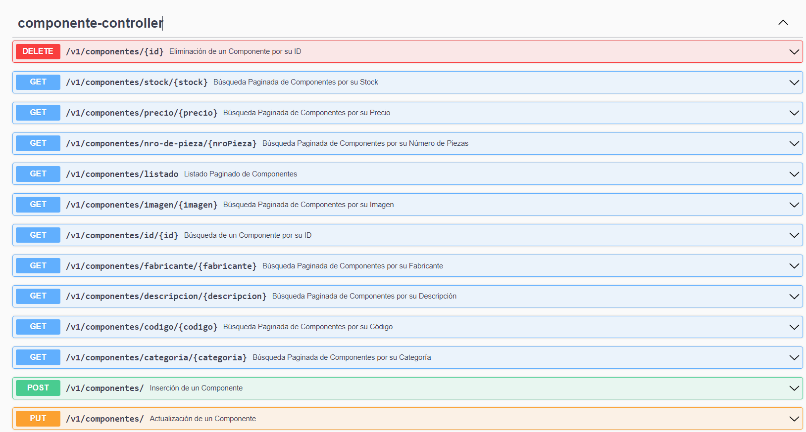

# ApiRest_Microelectronica_SpringBoot_Oracle
Api Restful para la gestión de Componentes de Microelectrónica implementada con Spring boot, Spring data, Maven, UI Swagger, Lombok, Oracle XE 21c, Git y otras tecnologías.

</br>

* [Repositorio base de datos](https://github.com/andresWeitzel/db_microelectronica_Oracle)
* [PlayList del Proyecto](https://www.youtube.com/playlist?list=PLCl11UFjHurAmc1wYGmkSdOOYyeo_6Ekj)
 


<br>

## Índice 📜

<details>
 <summary> Ver </summary>
 
 <br>
 
### Sección 1) Descripción, Tecnologías y Dependencias 

 - [1.0) Descripción del Proyecto.](#10-descripción-)
 - [1.1) Ejecución del Proyecto.](#11-ejecución-del-proyecto-)
 - [1.2) Patrones de Diseño.](#12-patrones-de-diseño-)
 - [1.3) Tecnologías.](#13-tecnologías-)
 - [1.4) Dependencias Maven.](#14-dependencias-maven-)

  
### Sección 2) Endpoints y Recursos 
 
 - [2.0) EndPoints.](#endpoints-)
 - [2.1) Recursos y Servicios.](#recursos-y-servicios-)
  
  
### Sección 3) Prueba de Funcionalidad y Referencias
 
 - [3.0) Prueba de Funcionalidad.](#30-prueba-de-funcionalidad-)
 - [3.1) Referencias.](#31-referencias-)
	  
  
  
<br>

</details>


<br>

## Sección 1) Descripción, Tecnologías y Dependencias 


### 1.0) Descripción [🔝](#índice-) 

<details>
  <summary>Ver</summary>
 
 <br>
 
* Esta Api Restful consta de todas las Operaciones CRUD , b úsquedas independientes de tipo like , paginaciones, búsquedas con filtro, todos los objetos de tipo getBy se manipulan como paginados, salvo los getById que se requiere un response por objeto. Se Desarrollan Clases Específicas para el Manejo de Excepciones para cada Servicio Completo , todas las funcionalidades tienen generación de logs en el Server para los errores y excepciones personalizadas, documentación completa de la Api con open-apiV3.0 para la visualización con swagger-UI, las anotaciones de dicha doc se aplican junto con los códigos de respuesta de tipo HTTP para cada función en los controllers.
* Se pone a disposición todos los recursos anteriores SÓLO para Componentes y Componentes Detalles . 

</br>

* [Repositorio base de datos](https://github.com/andresWeitzel/db_microelectronica_Oracle)
* [PlayList del Proyecto](https://www.youtube.com/playlist?list=PLCl11UFjHurAmc1wYGmkSdOOYyeo_6Ekj)
 

<br>

</details>


### 1.1) Ejecución del Proyecto [🔝](#índice-)

<details>
  <summary>Ver</summary>
  
 <br>  
  
* Ejecutar la base de datos del proyecto.
* Crear un entorno de trabajo a través de algún IDE (Para este caso utilizo STS 4). 
* Clonar el Proyecto (`git clone https://github.com/andresWeitzel/ApiRest_Microelectronica_SpringBoot_Oracle`)
* Utilizando sts, dentro del package explorer click derecho sobre el proyecto, run as spring boot app.
* Verificar logs del server.
* Comprobar cada endpoint.

<br>

</details>


### 1.2) Patrones de Diseño [🔝](#índice-)

<details>
  <summary>Ver</summary>
  <br>

| **Patrón de Diseño** | **Finalidad** |               
| ------------- | ------------- |
| [DAO](https://www.oscarblancarteblog.com/2018/12/10/data-access-object-dao-pattern/) | Uso de interfaces entre la aplicación y el almacenamiento de datos. |
| [MVC](https://keepcoding.io/blog/que-es-el-patron-de-arquitectura-mvvm/) | Separación y Representación de los Datos, Manejo de errores, Escalabilidad, etc  |

<br>
</details>


### 1.3) Tecnologías [🔝](#índice-)

<details>
  <summary>Ver</summary>
 
 <br>

| Tecnologías BACKEND | Versión | Finalidad
| ------------- | ------------- | ------------- |
| [Java]( https://www.oracle.com/java/technologies/javase/jdk12-archive-downloads.html) |   12.0.2 | JDK |
| [Spring Tool Suite 4](https://spring.io/blog/2021/06/21/spring-tools-4-11-0-released) | 4.9.0  | IDE |
| [Spring Boot](https://spring.io/) |   2.6.4  | Framework |
| [Spring Boot Data JPA](https://spring.io/projects/spring-data-jpa)  | 2.6.3 | Mapeo de objetos y persistencia en la db |
| [Spring Security](https://spring.io/projects/spring-security) | 2.6.7 | Servicios de Seguridad |
| [JSON Web Token](https://jwt.io/) | 0.9.1 | Creación de tokens de acceso | 
| [Maven](https://maven.apache.org/) |  4.0.0 | Gestor de Proyectos |
| [Postman](https://www.postman.com/) | 9.4.1 | Test de Apis |
| [Lombok](https://projectlombok.org/) | 1.18.22 | Automatización de Código | 
| [Open-Api](https://www.openapis.org/) | 1.6.4 | Documentación de la Api |
| [Oracle XE 21c](https://www.oracle.com/database/technologies/xe-downloads.html) | 21.4.1 | Sistema de Gestión de Bases de Datos |
| [SQL Developer](https://www.oracle.com/database/sqldeveloper/) | 21.4.1  | Editor de Base de Datos |
| [UI Swagger](https://swagger.io/tools/swagger-ui/) | 1.6.4 | Visualización y Gestión de la Api | 
| [GNU bash / Terminal](https://www.gnu.org/software/bash/) | 4.4.23  | Bash / Terminal para el manejo e implementación de Git integrado al Spring Tool Suite |
| [Git](https://git-scm.com/) | 2.29.1  | Control de Versiones |


<br>

</details>


### 1.4) Dependencias Maven [🔝](#índice-)

<details>
 <summary>Ver</summary>
 
 <br>

| **Dependencia Maven**  | **Versión** | **Finalidad** |             
| ------------- | ------------- | ------------- |
| spring-boot-starter-data-jpa | 2.6.4 | Api de JpaRepository para el manejo de métodos | 
| spring-boot-starter-test | 2.6.4 | Para Testing | 
| spring-boot-starter-web | 2.6.4 | Se agrega toda la configuración web automáticamente de Maven a Spring | 
| springdoc-openapi-ui | 1.6.4 | Plantillas para el Front |
| spring-boot-devtools | 2.6.4 | Herramientas para el Manejo de Spring Boot | 
| ojdbc8 | 21.3.0.0 | Driver para el SGDB Oracle | 
| lombok | 1.18.22 |  Dependencia para la automatización de Código |


<br>

</details>


<br>

## Sección 2) EndPoints y Recursos

### 2.0) EndPoints [🔝](#índice-)

<details>
 <summary>Ver</summary>
 
### EndPoints Generales
* http://localhost:8096/swagger-ui/index.html#/componente-controller
* http://localhost:8096/swagger-ui/index.html#/componente-detalle-controller
* http://localhost:8096/swagger-ui/index.html#/componente-transistor-bipolar-controller
* http://localhost:8096/swagger-ui/index.html#/componente-capacitor-electrolitico-controller


### Controllers .
 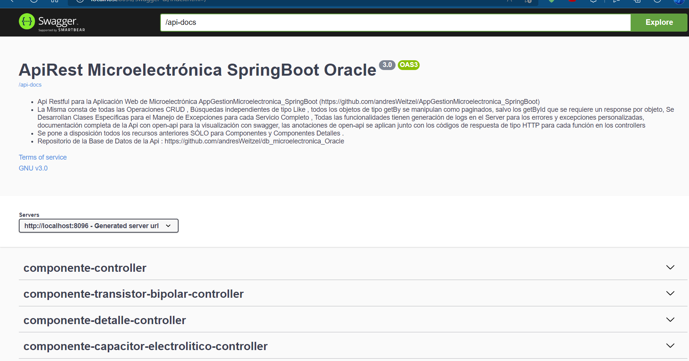
 
 ### Documentación ComponenteController.
 

* Algunos de los recursos de cada endpoint se muestran en las siguientes imágenes.

<br>

</details>

### 2.1) Recursos por Endpoints. (Swagger UI) [🔝](#índice-)

<details>
 <summary>Ver</summary>
 
###  GET - Listado de Componentes
### Listado Completo de Componentes desde el Nagevador
  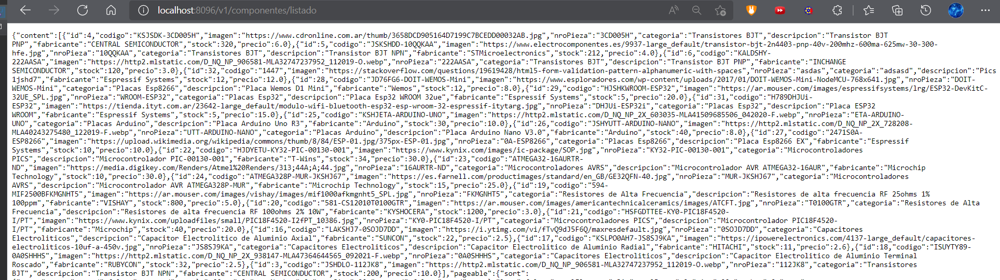
 
### Listado Paginado de Componentes 
  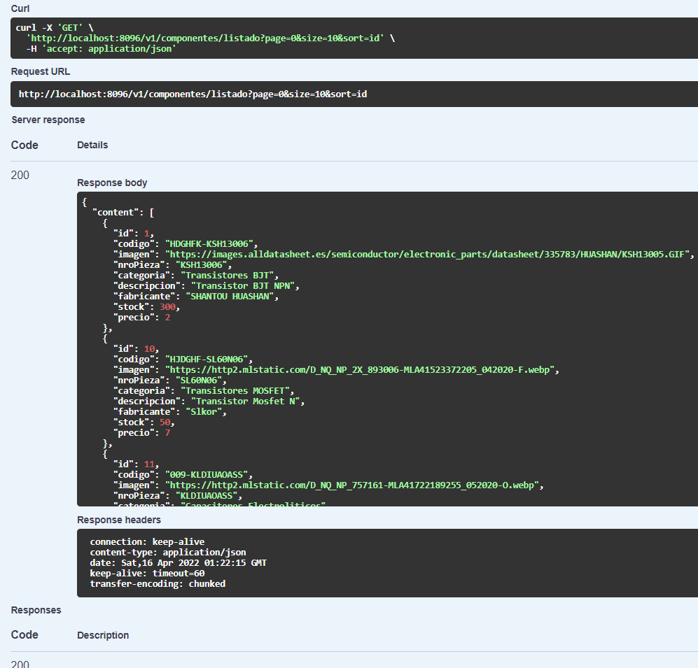
 
<br> 
 
### POST - Agregar un Componente

### RequestBody
 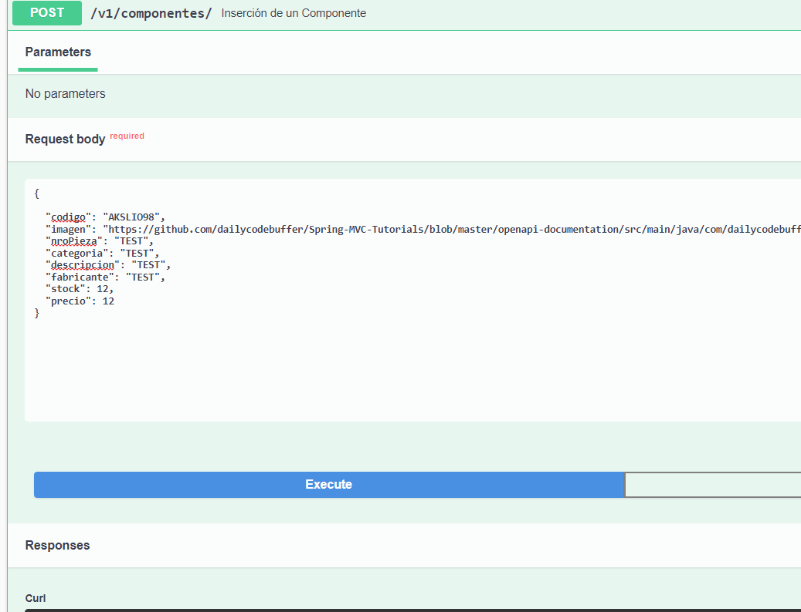
 
### Response
 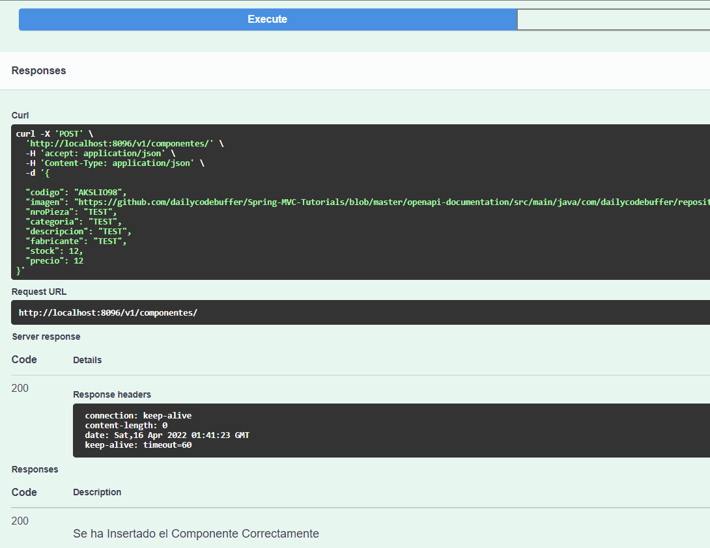
 
### getByDescripcion
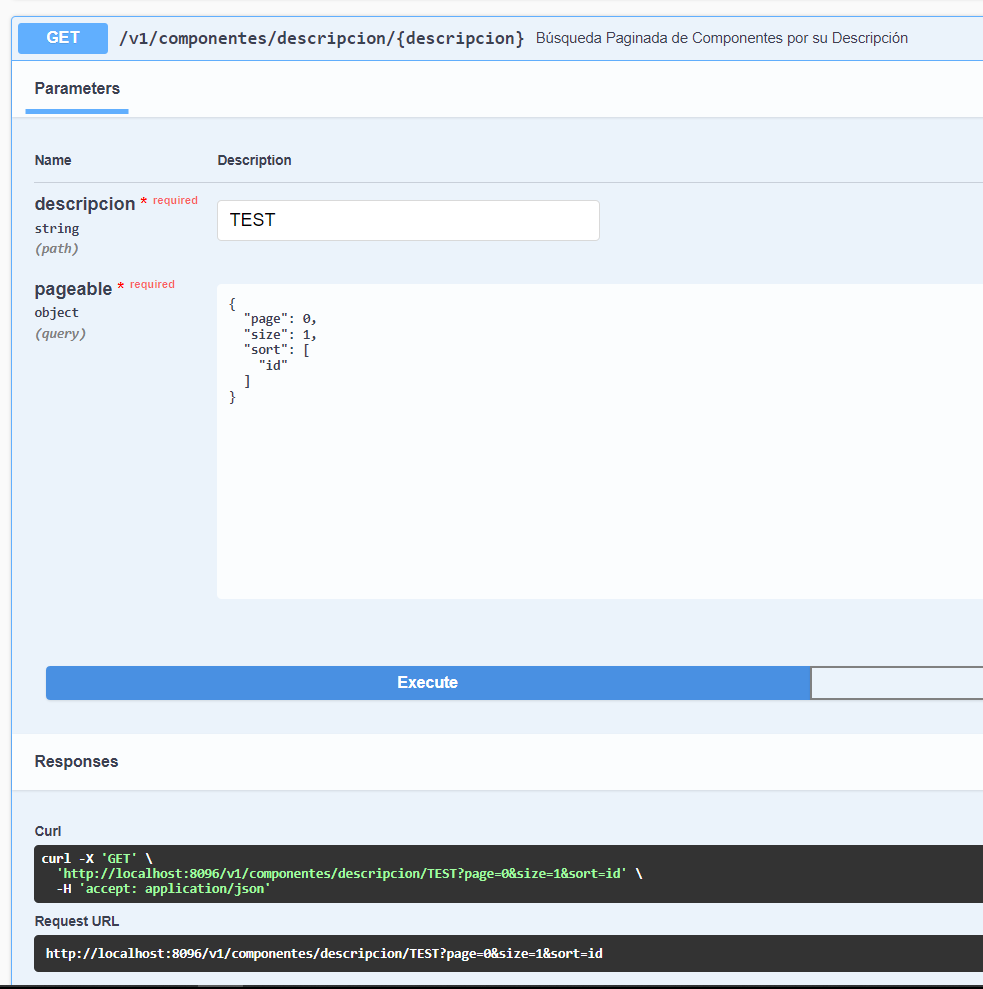
 
### Response
 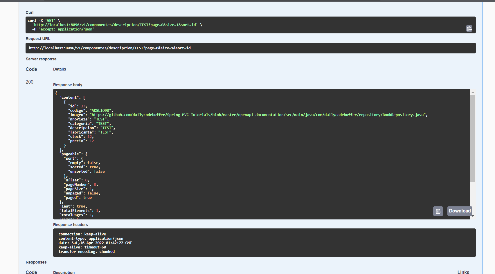
 
 
 <br> 

### PUT - Actualizar un Componente.

### RequestBody
 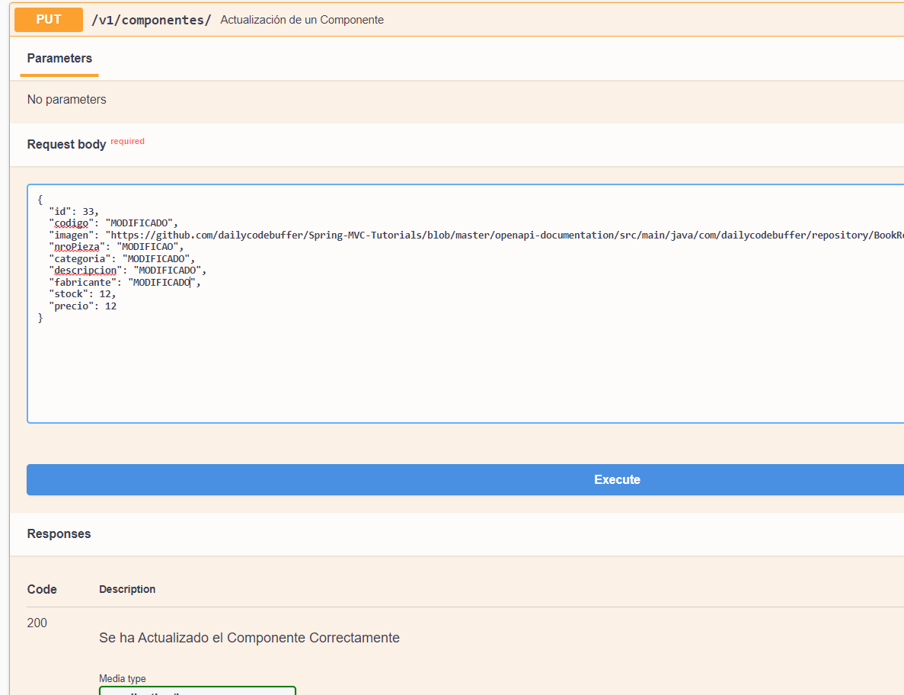
 
### Response
 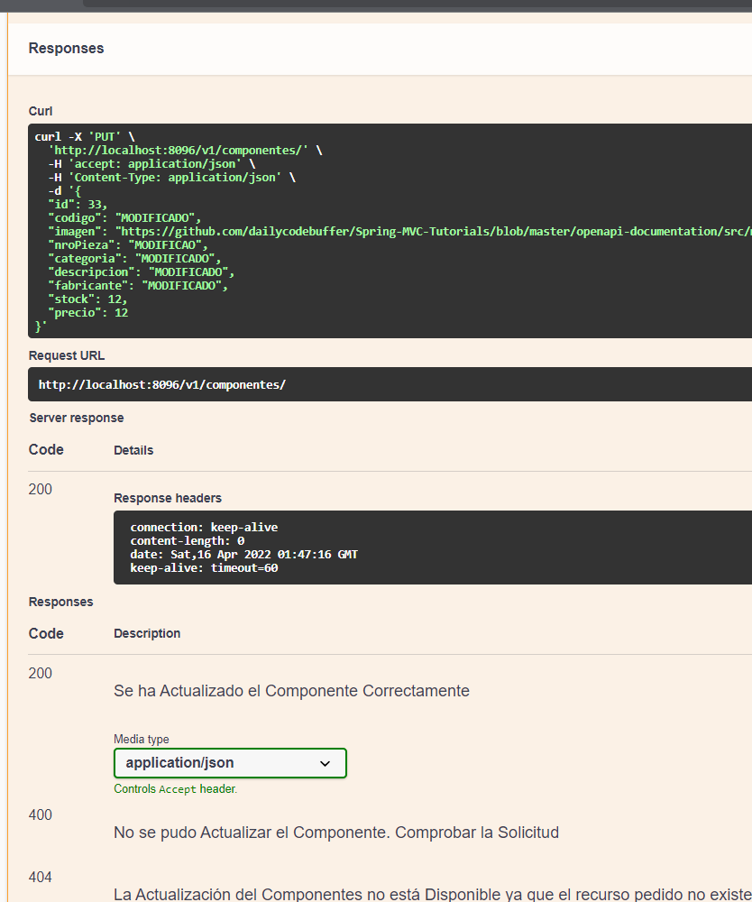
 
### getByFabricante
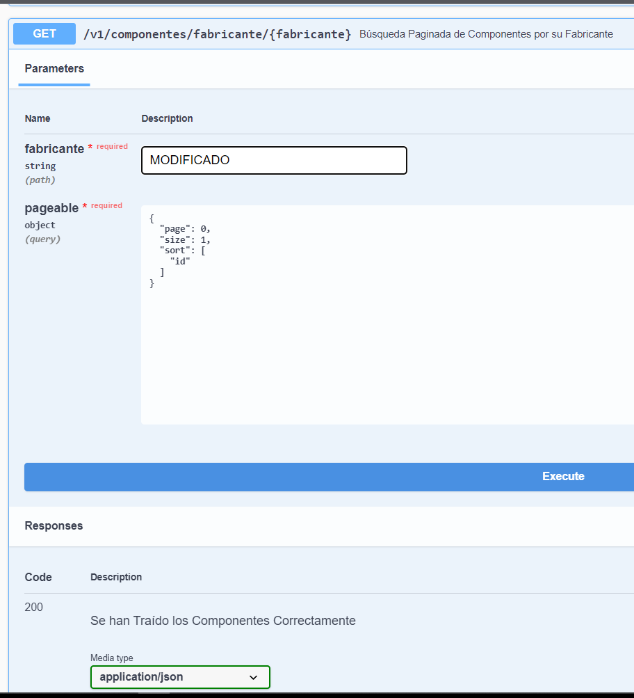
 
### Response
 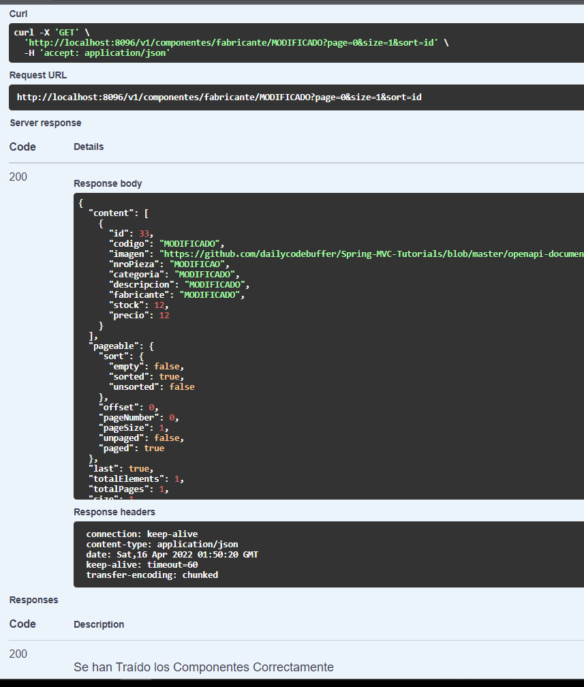
 
   
 <br> 

### DELETE - Eliminar un Componente

### RequestBody
 
 
### getById..
 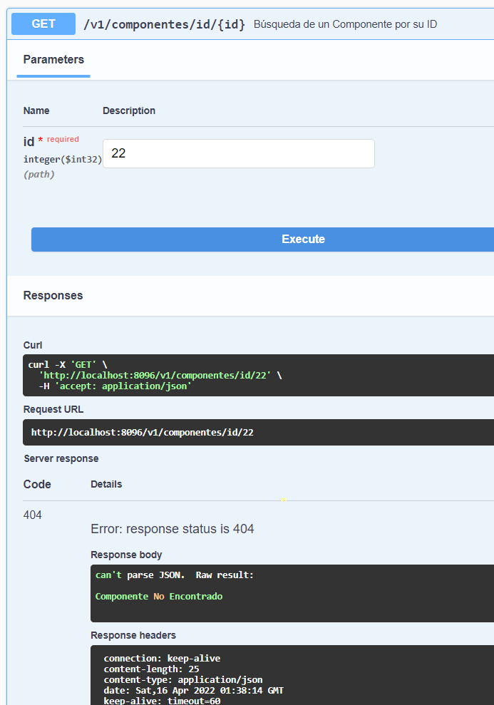
 
### Response lado del server..
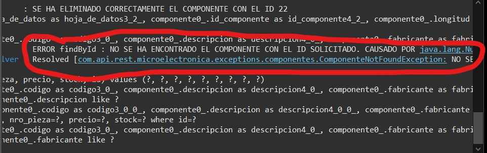
 
<br>

</details>


<br>

## Sección 3) Prueba de Funcionalidad y Referencias


### 3.0) Prueba de Funcionalidad [🔝](#índice-)

<details>
 <summary>Ver</summary>

### [Visualizar prueba de funcionalidades](https://www.youtube.com/playlist?list=PLCl11UFjHurAmc1wYGmkSdOOYyeo_6Ekj)
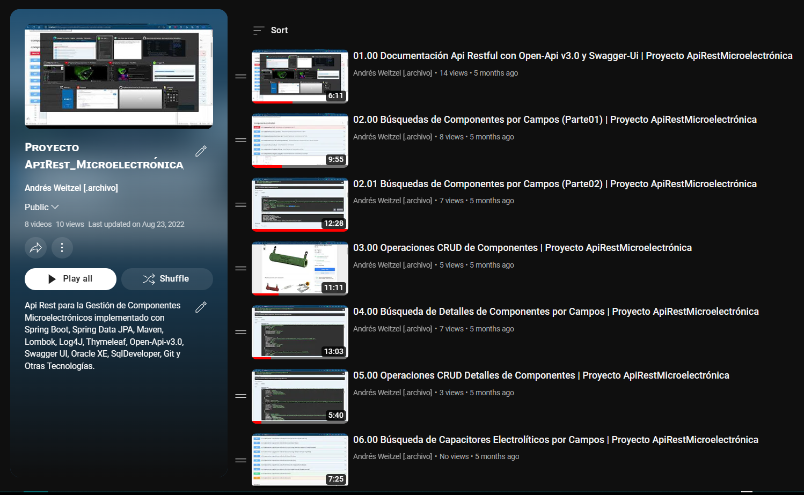

 <br>

</details>


### 3.1) Referencias [🔝](#índice-)

<details>
 <summary>Ver</summary>


### Documentación No Oficial Recomendada.

* Config open-api y Swagger: https://www.baeldung.com/spring-rest-openapi-documentation
* Tutorial doc open-api : https://www.youtube.com/watch?v=iaVBleTf88U
* Ej de anotation open-api : https://github.com/dailycodebuffer/Spring-MVC-Tutorials/blob/master/openapi-documentation/src/main/java/com/dailycodebuffer/controller/BookController.java
* Códigos HTTP de respuestas desarrollar en apis :https://www.ibm.com/docs/es/odm/8.5.1?topic=api-rest-response-codes-error-messages


 <br>

</details>


<br>

<br>

<br>

### `Siguiente sección en proceso de actualización` 

<details>
 <summary>Ver</summary>
  

## ` Documentación y Guía del Proyecto `
#### (Esta Documentación que Desarrollé es para la Creación y Configuración de la API, Manejo y Dependencias de Maven, Spring Tool Suite, Spring Booot, Hibernate-JPA, Oracle, Open-Api, Swagger UI y otros usos. Recomiendo Leerla y Realizar todo paso a paso como se indica en la misma).

</br>

## Indice.

#### Sección 1) Creación y Configuraciones del Proyecto 
   
   - [Paso 1) Creación y Configuraciones de un Proyecto Spring Boot con Maven en Spring Tool Suite 4.](#paso-1-creación-de-un-proyecto-spring-boot-con-maven-en-spring-tool-suite-4-y-configuraciones-iniciales)
  
   - [Paso 2) Otras Configuraciones del Proyecto.](#paso-2-otras-configuraciones-del-proyecto)


#### Sección 2) Dependencias del Proyecto, Descarga de Lombok y Archivo de Propiedades
   
   - [Paso 3) Listado de Dependencias.](#paso-3-listado-de-dependencias)

   - [Paso 4) Descarga de Lombok.](#paso-4-descarga-de-lombok)
   
   - [Paso 5) Archivo de Propiedades(application.properties).](#paso-5-configuraciones-del-application.properties) 
   


#### Sección 3) Creación y Configuración de las Clases Entities/Models
  
   - [Paso 6) Creación y Configuración de la Clase ComponenteEntity](#paso-6-creación-y-configuración-de-la-clase-componenteentity)
   
   - [Paso 7) Creación y Configuración de la Clase ComponenteDetalleEntity](#paso-7-creación-y-configuración-de-la-clase-componentedetalleentity)

   - [Paso 8) Creación y Configuración de la Clase ComponenteCapacitorElectroliticoEntity](#paso-8-creación-y-configuración-de-la-clase-componentecapacitorelectroliticoentity)
  
   - [Paso 9) Creación y Configuración de la Clase ComponenteTransistorBipolarEntity](#paso-9-creación-y-configuración-de-la-clase-componentetransistorbipolarentity)
  
  

  
  
#### Sección 4) Creación y Configuración de las Interfaces Repositories  

   - [Paso 10) Creación y Configuración de la Interfaz Repository I_ComponenteRepository](#paso-10-creación-y-configuración-de-la-interfaz-repository-i-componenterepository)

   - [Paso 11) Creación y Configuración de la Interfaz Repository I_ComponenteDetalleRepository](#paso-11-creación-y-configuración-de-la-interfaz-repository-i-componentedetallerepository)

   - [Paso 12) Creación y Configuración de la Interfaz Repository I_ComponenteCapacitorElectroliticoRepository](#paso-12-creación-y-configuración-de-la-interfaz-repository-i-componentecapacitorelectroliticorepository)

   - [Paso 13) Creación y Configuración de la Interfaz Repository I_ComponenteTransistorBipolarRepository](#paso-13-creación-y-configuración-de-la-interfaz-repository-i-componentetransistorbipolarrepository)


#### Sección 5) Creación y Configuración de los Services y Excepciones de Clase

   - [Paso 14) Creación y Configuración del Service ComponenteService con el manejo de Excepciones de Clase](#paso-14-creación-y-configuración-del-service-componenteservice-con-el-manejo-de-excepciones-de-clase)
   
   - [Paso 15) Creación y Configuración del Service ComponenteDetalleService](#paso-15-creación-y-configuración-del-service-componentedetalleservice) 

   - [Paso 16) Creación y Configuración del Service ComponenteCapacitorElectroliticoService](#paso-16-creación-y-configuración-del-service-componentecapacitorelectroliticoservice) 

   - [Paso 17) Creación y Configuración del Service ComponenteTransistorBipolarService](#paso-17-creación-y-configuración-del-service-componentetransistorbipolarservice) 


#### Sección 6) Creación y Configuración de los Controllers
	
   - [Paso 18) Creación y Configuración del Controller ComponenteController](#paso-18-creación-y-configuración-del-controller-componentecontroller)
   
   - [Paso 19) Creación y Configuración del Controller ComponenteDetalleController](#paso-19-creación-y-configuración-del-service-componentedetallecontroller) 
 
   - [Paso 20) Creación y Configuración del Controller ComponenteCapacitorElectroliticoController](#paso-20-creación-y-configuración-del-service-componentecapacitorelectroliticocontroller) 
   
   - [Paso 21) Creación y Configuración del Controller ComponenteTransistorBipolarController](#paso-21-creación-y-configuración-del-service-componentetransistorbipolarcontroller) 


#### Sección 7) Prueba de los Servicios Rest Desarrollados

   - [Paso 22) Prueba del Servicio Rest de la Tabla componentes](#paso-22-prueba-del-servicio-rest-de-la-tabla-componentes) 
   
   - [Paso 23) Prueba del Servicio Rest de la Tabla componentes_detalles](#paso-23-prueba-del-servicio-rest-de-la-tabla-componentes-detalles) 

   - [Paso 24) Prueba del Servicio Rest de la Tabla componentes-capacitores-electroliticos](#paso-24-prueba-del-servicio-rest-de-la-tabla-componentes-capacitores-electroliticos) 

   - [Paso 25) Prueba del Servicio Rest de la Tabla componentes-transistores_bipolares](#paso-25-prueba-del-servicio-rest-de-la-tabla-componentes-transistores-bipolares) 


#### Sección 9) Uso y Manejo de Git

   - [Paso 26) Descarga y Configuración de Git](#paso-26-descarga-y-configuración-de-git)

   - [Paso 27) Subir el proyecto al repositorio de github desde la consola de git](#paso-27-subir-el-proyecto-al-repositorio-de-github-desde-la-consola-de-git)
   
   - [Paso 28) Actualización del repositorio del proyecto desde la consola de GIT](#paso-28-actualización-del-repositorio-del-proyecto-desde-la-consola-de-GIT)


</br>

## Sección 1) Creación y Configuraciones del Proyecto 

</br>


### Paso 1) Creación de un Proyecto Spring Boot con Maven en Spring Tool Suite 4 y Configuraciones Iniciales.
#### (Primeramente deberás configurar tu espacio de trabajo, en donde se alojará la aplicación. Cada vez que muevas el Proyecto de Directorio, recomiendo crear o setear nuevamente el Espacio de Trabajo).


* Una vez abierto Spring Tool Suite 4
  	* --> Seleccionas la Pestaña `File` 
   	* --> New 
   	* --> Spring Starter Proyect (Si no aparece buscar en Other).

* Se abrirá una Interfaz Gráfica, por defecto dejar marcado lo siguiente con los siguientes valores por defecto
   	 * --> Service Url : https://start.spring.io
   	 * --> Use default location por defecto (es la ruta absoluta de tu workspace)
   	 * --> Type : Maven
	 * --> Java Version : 8
	 * --> Packaging : Jar
	 * --> Language : Java
	 * --> Artifact : Por Defecto como está (cambia automáticamente cuando escribimos el Name del Proyect)
	  * --> Version  : Por Defecto como está
	  * --> Working Sets Desmarcado.

* Configuramos lo restante
   * --> Name : ApiRest_Microelectronica (Nombre del proyecto, en mi caso este). Debe cambiarse aut. el Artifact
   * --> Group : com.api.rest.microelectronica (Nombre del grupo, en mi caso este).
   * --> Description: la deseada.
   * --> Package : com.api.rest.microelectronica (Nombre del grupo, este en mi caso).
   * --> Next

* En la Nueva Interfaz Gráfica elegimos la versión y dependencia
   * --> Spring Boot Versión : 2.6.4 o una que no sea la última
   * --> Vamos a seleccionar las dependencias necesarias
   * --> Dependencias : Spring Web, Spring Data JPA, Spring Boot DevTools, Lombok y Oracle Driver. Luego agregaremos las deseadas desde maven repositories
   * --> Next, Next y Seguidamente Finish.

* Esperar a que finalice Spring la creación del Proyecto


</br>


### Paso 2) Otras Configuraciones del Proyecto.
#### (Para este paso se anexan configuraciones que para el Proyecto son relevantes, capaz creando el Proyecto desde otro IDE se autoconfiguran dichas configuraciones).

</br>

#### 2.1) Actualización de Java-1.7 a 1.8 (Si seleccionaste una versión Moderna de Spring no es Necesario esto)

* Vamos al `pom.xml` (el archivo al final de todo)

* Dentro de el tag `properties` donde dice java.versión cambiar la version del compiler a 1.8, ctrl+s para guardar

* Click Derecho sobre el Proyecto
	* --> Maven
	* --> Update Proyect
	* --> Fijate que el Proyecto este seleccionado y Boton ok

* Si cambio JavaSE-1.7 a JavaSE-1.8 se efectuo el cambio

</br>

#### 2.2) Paquetes Maven `(Java Resources)`. (Si seleccionaste una versión Moderna de Spring no es Necesario esto)

* Por Defecto Viene deshabilitada la opción de paquetes Maven, en donde vamos a guardar nuestros paquetes y clases
	* --> Para habilitar las mismas, click Der sobre el Proyecto.
	* --> Properties.
	* --> Buscamos la sección `Java Build Path`
	* --> Seleccionamos la casilla `Maven Dependencies`.
	* --> Apply and Close.
	* --> F5 y deberían aparecer `src/main/java` y `src/test/java`


</br>

## Sección 2) Dependencias del Proyecto, Descarga de Lombok y Uso del SGDB Oracle

</br>


### Paso 3) Listado de Dependencias.
#### (Las siguientes dependencias del Proyecto deberán estar en el pom.xml para el correcto funcionamiento del Proyecto. Puede ocurrir que haya más dependencias que las mencionadas, por defecto spring proporciona las generales, el resto las buscamos desde Maven Repositories).


```xml
<?xml version="1.0" encoding="UTF-8"?>
<project xmlns="http://maven.apache.org/POM/4.0.0"
	xmlns:xsi="http://www.w3.org/2001/XMLSchema-instance"
	xsi:schemaLocation="http://maven.apache.org/POM/4.0.0 https://maven.apache.org/xsd/maven-4.0.0.xsd">
	<modelVersion>4.0.0</modelVersion>
	<parent>
		<groupId>org.springframework.boot</groupId>
		<artifactId>spring-boot-starter-parent</artifactId>
		<version>2.6.6</version>
		<relativePath /> <!-- lookup parent from repository -->
	</parent>
	<groupId>com.api.rest.microelectronica</groupId>
	<artifactId>ApiRest_Microelectronica</artifactId>
	<version>0.0.1-SNAPSHOT</version>
	<name>ApiRest_Microelectronica</name>
	<description>Api Rest para la Aplicacion Web de Microelectrónica</description>
	<properties>
		<java.version>11</java.version>
	</properties>
	<dependencies>
		<dependency>
			<groupId>org.springframework.boot</groupId>
			<artifactId>spring-boot-starter-data-jpa</artifactId>
		</dependency>
		<dependency>
			<groupId>org.springframework.boot</groupId>
			<artifactId>spring-boot-starter-web</artifactId>
		</dependency>

		<dependency>
			<groupId>org.springframework.boot</groupId>
			<artifactId>spring-boot-devtools</artifactId>
			<scope>runtime</scope>
			<optional>true</optional>
		</dependency>
		<dependency>
			<groupId>com.oracle.database.jdbc</groupId>
			<artifactId>ojdbc8</artifactId>
			<scope>runtime</scope>
		</dependency>
		<dependency>
			<groupId>org.projectlombok</groupId>
			<artifactId>lombok</artifactId>
			<optional>true</optional>
		</dependency>

		<!-- OPENAPI-UI -->
		<dependency>
			<groupId>org.springdoc</groupId>
			<artifactId>springdoc-openapi-ui</artifactId>
			<version>1.6.4</version>
		</dependency>


		<dependency>
			<groupId>org.springframework.boot</groupId>
			<artifactId>spring-boot-starter-test</artifactId>
			<scope>test</scope>
		</dependency>
	</dependencies>

	<build>
		<plugins>
			<plugin>
				<groupId>org.springframework.boot</groupId>
				<artifactId>spring-boot-maven-plugin</artifactId>
				<configuration>
					<excludes>
						<exclude>
							<groupId>org.projectlombok</groupId>
							<artifactId>lombok</artifactId>
						</exclude>
					</excludes>
				</configuration>
			</plugin>
		</plugins>
	</build>

</project>

```

</br>

* ...
* Ctrl + s Guardas 
* Click Der sobre el proyecto
* Maven y update Maven o Alt + F5
* Fijarse dentro de Maven Dependencies si Maven descargo las mismas
 

</br>


### Paso 4) Descarga de `Lombok`.
* Seguidamente de tener el jars a través de la dependencia en nuestro proyecto, vamos a instalar lombok para poder utilizarlo, no basta con la descarga, hay que realizar la configuración y descarga del mismo en nuestro ordenador.
* Buscamos el jar en Maven Dependencies `lombok-1.18....` Click derecho y properties
* Pestaña Java Source Attachment y buscamos el Path donde se descargo el jar de lombok.
* Nos dirigimos a dicha carpeta, en mi caso `C:\Users\andre\.m2\repository\org\projectlombok\lombok\1.18.22` y ejecutamos el jar de lombok `lombok-1.18.22.jar`
* VAMOS A REALIZAR LA INSTALACIÓN EN LA CARPETA DE CONFIGURACIÓN DE NUESTRO IDE SELECCIONANDO SELECCIONANDO SPECIFY LOCATION, EN MI CASO SPRING TOOL SUITE `C:\Program Files (x86)\sts-4.13.1.RELEASE`
* Instalamos, siguiente siguiente...
* Cerramos y Abrimos el IDE para que los cambios se ejecuten correctamente


</br>


### Paso 5) Configuraciones del `application.properties`.
#### (Vamos a utilizar el esquema de conexión de nuestra db ya creado en otro repositorio acerca de productos de microelectronica, las dudas referentes a la misma se encuentra en su respectivo repositorio....https://github.com/andresWeitzel/db_microelectronica_Oracle)

</br>

* Como se mencionó, todos los pasos para trabajar con este esquema/db se encuentra en el respectivo repositorio, la información relevante será el nombre y contraseña de usuario o rol levantado en el respectivo esquema creado (db_microelectronica) de oracle..
```xml
username: admin_microelectronica

password: admin_microelectronica
```
* Las Configuraciones para el sgdb oracle serían..
* La URL es un estandar de uso, a comparación de otros sgdb que hay que pasarle que tipo de db se deberá utilizar en oracle no es necesario, sino el tipo de Oracle a implementarm, si es XE(Express Edition), o lo que fuese

```xml
spring.datasource.driver-class-name=oracle.jdbc.OracleDriver
spring.datasource.url=jdbc:oracle:thin:@localhost:1521/XE?serverTimezone=UTC
spring.datasource.username=admin_microelectronica
spring.datasource.password=admin_microelectronica
spring.jpa.database=oracle
```
* Además del dialect todas las config para trabajar con spring-data-jpa
```xml
spring.jpa.show-sql = true
spring.jpa.hibernate.ddl-auto = update
spring.jpa.hibernate.naming.strategy = org.hibernate.cfg.ImprovedNamingStrategy
spring.jpa.properties.hibernate.dialect = org.hibernate.dialect.Oracle12cDialect

```
* Para Trabajar con open-api y swagger ui vamos a configurar la ruta de la vista de swagger entre otros
 ```xml
#---CONFIG OPEN-UI -----
springdoc.api-docs.path=/api-docs

#---CONFIG SWAGGER -----
springdoc.swagger-ui.path=/swagger-ui-custom.html
springdoc.swagger-ui.operationsSorter=method
```
* Para manejar las configs de las paginaciones
 ```xml
#---CONFIG PAGINATION---
spring.data.rest.page-param-name=page
spring.data.rest.sort-param-name=sort
spring.data.rest.limit-param-name=limit
spring.data.rest.default-page-size = 10
```

* xml completo..
 ```xml

server.port = 8096
server.error.whitelabel.enabled=true

#---CONFIG ORACLE DB---
spring.datasource.driver-class-name=oracle.jdbc.OracleDriver
spring.datasource.url=jdbc:oracle:thin:@localhost:1521/XE?serverTimezone=UTC
spring.datasource.username=admin_microelectronica
spring.datasource.password=admin_microelectronica
spring.jpa.database=oracle

#---CONFIG SPRING-JPA---
spring.jpa.show-sql = true
spring.jpa.hibernate.ddl-auto = update
spring.jpa.hibernate.naming.strategy = org.hibernate.cfg.ImprovedNamingStrategy
spring.jpa.properties.hibernate.dialect = org.hibernate.dialect.Oracle12cDialect


#---CONFIG OPEN-UI -----
springdoc.api-docs.path=/api-docs

#---CONFIG SWAGGER -----
springdoc.swagger-ui.path=/swagger-ui-custom.html
springdoc.swagger-ui.operationsSorter=method


#---CONFIG PAGINATION---
spring.data.rest.page-param-name=page
spring.data.rest.sort-param-name=sort
spring.data.rest.limit-param-name=limit
spring.data.rest.default-page-size = 10
```


 </br>
 
 </br>

## Sección 3) Creación y Configuración de las Clases Entities/Models

</br>

### Paso 6) Creación y Configuración de la Clase Entidad/Modelo ` ComponenteEntity`
#### (Voy a implementar un modelo que aplicará a todas las entidades, para no replicar código en el readme, ciertos campos van a variar dependiendo de cada Tabla a implementar, consultar esquema de tablas y campos en el repo de la base de datos....https://github.com/andresWeitzel/db_microelectronica_Oracle)

</br>

#### 6.1) Creación de la Clase `ComponenteEntity`

* Creamos un paquete llamado `entities` dentro de com.gestion.microelectronica (src/main/java/com.gestion.microelectronica). Es importante que este dentro del mismo ya que sino Spring no desplegará la app de forma correcta.
	* --> Click Der sobre la ruta mencionada  
	* --> New --> Package
	* --> En Name seguido de `com.gestion.microelectronica` colocamos `entities` (com.api.productos.entities)
	* --> Finish

* Creamos la Entity
 	* --> Click Der sobre el paquete creado
 	* --> New --> Class
 	* --> Siempre asegurarse la ruta de creación a través del Source Folder y Package
 	* --> En Name colocamos ComponenteEntity
 	* --> Finish

```java

package com.gestion.microelectronica.entities;

public class ComponenteEntity {

}

```


</br>

#### 6.2) Configuración de la Clase `ComponenteEntity`
* Creamos los atributos o campos de la Clase, usaremos las anotations correspondientes de JPA que a su vez estas serán nombres de campos de la db 
* No crearemos getters ni setters, ni el resto  ya que utilizaremos Lombok ( Asegurarse de haber instalado todo correctamente )
* Es importante tener en consideración que si se tiene registros en la db al momento de insertar uno nuevo desde el servicio rest que desarrollaremos por defecto oracle posee un sistema de seguridad para los id en relación a otros sgdb. Entonces debemos crear una secuencia id en java que relacione a la secuencia id ya creada en la base de datos. La secuencia que crearemos se llamará `seq_comp` que se relacionará con la de la db `id_seq_comp`..
```java
	@GeneratedValue(strategy = GenerationType.SEQUENCE, generator = "seq_comp")
	@SequenceGenerator(name = "seq_comp", sequenceName = "id_seq_comp" , allocationSize=1)
	@Id
	@Column(name="id") 
	private int id;
```
* Las anotaciones para lombok son `@Data` , `@AllArgsConstructor` y `@NoArgsConstructor` , la primera para la generacion de los getters y setters y el resto de metodos, la segunda para los constructores sobrecargados de la Entidad y la tercera para constructor vacio .
* Importante hacer referencia al nombre de la tabla de la db `@Table(name="componentes")`
* Código..
```java
package com.gestion.microelectronica.entities;

import javax.persistence.Column;
import javax.persistence.Entity;
import javax.persistence.GeneratedValue;
import javax.persistence.GenerationType;
import javax.persistence.Id;
import javax.persistence.SequenceGenerator;
import javax.persistence.Table;

import lombok.AllArgsConstructor;
import lombok.Data;
import lombok.NoArgsConstructor;

@Table(name="componentes")
@Entity
@Data
@AllArgsConstructor
@NoArgsConstructor
public class ComponenteEntity {
	
	@GeneratedValue(strategy = GenerationType.SEQUENCE, generator = "seq_comp")
	@SequenceGenerator(name = "seq_comp", sequenceName = "id_seq_comp" , allocationSize=1)
	@Id
	@Column(name="id") 
	private int id;
	
	@Column(name="codigo")
	private String codigo;
	
	@Column(name="imagen")
	private String imagen;
	
	@Column(name="nro_pieza")
	private String nroPieza;
	
	@Column(name="categoria")
	private String categoria;
	
	@Column(name="descripcion") 
	private String descripcion;
	
	@Column(name="fabricante")
	private String fabricante;
	
	@Column(name="stock")
	private int stock;
	
	@Column(name="precio")
	private double precio;
	

}


```


</br>

### Paso 7) Creación y Configuración de la Clase Entidad/Modelo `ComponenteDetalleEntity`
#### (Se realiza el mismo procedimiento descrito detalladamente en el Paso Anterior )

</br>

### Paso 8) Creación y Configuración de la Clase `ComponenteCapacitorElectroliticoEntity`
#### (Se realiza el mismo procedimiento descrito detalladamente en los Pasos Anteriores )


</br>

### Paso 9) Creación y Configuración de la Clase `ComponenteTransistorBipolarEntity`
#### (Se realiza el mismo procedimiento descrito detalladamente en los Pasos Anteriores )

</br>


## Sección 4) Creación y Configuración de las Interfaces Repositories  

</br>

#### Paso 10) Creación y Configuración de la Interfaz Repository `I_ComponenteRepository` 
* Dentro de la jerarquia de paquetes `com.api.rest.microelectronica` creamos el paquete `repositories`
* Dentro del mismo la Interfaz `I_ComponenteRepository`
* Agregamos la annotation `@Repository` de la clase para JPA y usamos la interfaz  `JpaRepository<ComponenteEntity, Serializable>` junto con la Interfaz de Paginación `PagingAndSortingRepository<ComponenteEntity, Long>` para toda la funcionalidad para la creación de los métodos Jpa.
* Creamos y Definimos todos los métodos abstractos haciendo referencia a los campos de la entidad tentativos de uso. 
* Dichos Métodos serán paginados salvo los que devuelvan un solo objeto según si ID
* No creamos los métodos CRUD (add, save, update) en la interfaz, ya que declaramos todos los métodos abstractos sin devolución de valores como referencia.
* Además para mejorar la búsqueda de dichos métodos vamos a usar querys con HQL(Hibernate Query Lenguage) para obtener lo deseado según la cláusula de tipo LIKE 
* Código..

```java
package com.api.rest.microelectronica.repositories;

import java.io.Serializable;
import java.util.List;

import org.springframework.data.domain.Page;
import org.springframework.data.domain.Pageable;
import org.springframework.data.jpa.repository.JpaRepository;
import org.springframework.data.jpa.repository.Query;
import org.springframework.data.repository.PagingAndSortingRepository;
import org.springframework.stereotype.Repository;

import com.api.rest.microelectronica.entities.ComponenteEntity;


@Repository
public interface I_ComponenteRepository extends JpaRepository<ComponenteEntity, Serializable>, PagingAndSortingRepository<ComponenteEntity, Serializable>{

	//============================ MÉTODOS DE BÚSQUEDA ============================== 
	
		public abstract ComponenteEntity findById(int id);
		
		@Query("select c from ComponenteEntity c where c.codigo like %:codigo%")
		public abstract Page<ComponenteEntity> findByCodigo(String codigo, Pageable pageable);
		
		@Query("select c from ComponenteEntity c where c.imagen like %:imagen%")
		public abstract Page<ComponenteEntity> findByImagen(String imagen, Pageable pageable);
		
		@Query("select c from ComponenteEntity c where c.nroPieza like %:nroPieza%")
		public abstract Page<ComponenteEntity> findByNroPieza(String nroPieza, Pageable pageable);
		
		@Query("select c from ComponenteEntity c where c.categoria like %:categoria%")
		public abstract Page<ComponenteEntity> findByCategoria(String categoria, Pageable pageable);
		
		@Query("select c from ComponenteEntity c where c.descripcion like %:descripcion%")
		public abstract Page<ComponenteEntity> findByDescripcion(String descripcion , Pageable pageable);
		
		@Query("select c from ComponenteEntity c where c.fabricante like %:fabricante%")
		public abstract Page<ComponenteEntity> findByFabricante(String fabricante , Pageable pageable);
		
		public abstract Page<ComponenteEntity> findByStock(int stock , Pageable pageable);

		public abstract Page<ComponenteEntity> findByPrecio(double precio , Pageable pageable);

		public abstract Page<ComponenteEntity> findAll(Pageable pageable );

		@Query("select c from ComponenteEntity c where concat(lower(c.id), lower(c.codigo), lower(c.imagen)"
				+ ", lower(c.nroPieza), lower(c.categoria), lower(c.descripcion), lower(c.fabricante), lower(c.stock)"
				+ ", lower(c.precio)) like lower(concat ( '%', ?1 , '%'))")
		public abstract Page<ComponenteEntity> findAll(String filtro, Pageable pageable);

	
	
	
}

```

</br>

#### Paso 11) Creación y Configuración de la Interfaz Repository `I_ComponenteDetalleRepository` 
#### (Se realiza el mismo procedimiento descrito detalladamente en el Paso Anterior)


</br>

### Paso 12) Creación y Configuración de la Interfaz Repository `I_ComponenteCapacitorElectroliticoRepository` 
#### (Se realiza el mismo procedimiento descrito detalladamente en los Pasos Anteriores)


</br>

### Paso 13) Creación y Configuración de la Interfaz Repository `I_ComponenteTransistorBipolarRepository` 
#### (Se realiza el mismo procedimiento descrito detalladamente en los Pasos Anteriores)


</br>

## Sección 5) Creación y Configuración de los Services con el manejo de Excepciones de Clase

</br>
#### Paso 14) Creación y Configuración del Service `ComponenteService` con su Excepción de Clase

#### Paso 14.1) Creación y Configuración del Manejo de Excepciones de la Clase
* Dentro de la jerarquia de paquetes `com.api.rest.microelectronica` creamos el paquete `services`, el paquete `exceptions` para el control general y el paquete `exceptions.componentes` para esta clase
* Dentro del paquete exceptions.componentes la Clase `ComponenteNotFoundException`. Esta excepción la lanzaremos cuando no podamos realizar una operación entre la db y el service.
* Código de Clase..
```java
package com.api.rest.microelectronica.exceptions.componentes;

public class ComponenteNotFoundException extends RuntimeException {

	public ComponenteNotFoundException() {

	}

	public ComponenteNotFoundException(String msj) {
		super(msj);
	}

	public ComponenteNotFoundException(Throwable cause) {
		super(cause);
	}

	public ComponenteNotFoundException(String msj, Throwable cause) {
		super(msj, cause);
	}
	
	 public ComponenteNotFoundException(String msj, Throwable cause, boolean enableSuppression, boolean writableStackTrace) {
	        super(msj, cause, enableSuppression, writableStackTrace);
	    }

}

```
Luego creamos otra clase llamada `ComponentesIdMismatchException` para lanzarla cuando no podemos obtener el objeto según su ID
* Código de la Clase..
```java
package com.api.rest.microelectronica.exceptions.componentes;

public class ComponenteIdMismatchException extends RuntimeException{

	public ComponenteIdMismatchException() {

	}

	public ComponenteIdMismatchException(String msj) {
		super(msj);
	}

	public ComponenteIdMismatchException(Throwable cause) {
		super(cause);
	}

	public ComponenteIdMismatchException(String msj, Throwable cause) {
		super(msj, cause);
	}
	
	 public ComponenteIdMismatchException(String msj, Throwable cause, boolean enableSuppression, boolean writableStackTrace) {
	        super(msj, cause, enableSuppression, writableStackTrace);
	    }
	
}

```
* Por Último para el correcto funcionamiento de las Excepciones vamos a crear un manejador de excepciones que nos va a permitir controlar estas excepciones creadas.
* Heredamos de ResponseEntityExceptionHandler usamos la anotation `@RestControllerAdvice` para hacer referencia al conmtrolador de excepcionesd. Luego creamos el método que va a manejar nuestra excepción. Utilizamos la anotation `@ExceptionHandler` pasandole el nombre de la clase a utilizar y devolvemos el mensaje deseado con el estado http, etc
* Código de la Clase..
``` java
package com.api.rest.microelectronica.exceptions;

import org.springframework.http.HttpHeaders;
import org.springframework.http.HttpStatus;
import org.springframework.http.ResponseEntity;
import org.springframework.web.bind.annotation.ExceptionHandler;
import org.springframework.web.bind.annotation.RestControllerAdvice;
import org.springframework.web.context.request.WebRequest;
import org.springframework.web.servlet.mvc.method.annotation.ResponseEntityExceptionHandler;

import com.api.rest.microelectronica.exceptions.capacitor.electrolitico.CapacitorElectroliticoNotFoundException;
import com.api.rest.microelectronica.exceptions.componentes.ComponenteNotFoundException;
import com.api.rest.microelectronica.exceptions.componentes.detalles.ComponenteDetalleNotFoundException;

@RestControllerAdvice
public class CustomExceptionHandler extends ResponseEntityExceptionHandler {

    @ExceptionHandler({ComponenteNotFoundException.class})
    protected ResponseEntity<Object> ComponenteHandleNotFoundException(Exception ex, WebRequest request)
    {
        return handleExceptionInternal(ex, "Componente No Encontrado ",new HttpHeaders(), HttpStatus.NOT_FOUND, request);
    }

}
```

</br>

#### Paso 14.2) Creación y Configuración del Service `ComponenteService` 
* Agregamos la annotation `@Service` de la clase haciendo referencia para Spring y `@Autowired` para implementar Inyección de Dependencias de la interfaz creada.
* Usamos log4j para los logs de error en los métodos CRUD para la persistencia. 
* Desarrollamos el cuerpo de cada método de busqueda de la interfaz creada
* Cada uno de los Métodos CRUD tiene su comprobación de Persistencia y se lanzaran las debidas excepciones según sea el caso, los mismos pueden ser modificados para adicionar mayor seguridad.
* Todos los métodos, tanto CRUD como los de Búsqueda los menejaremos dentro de bloques try catch para el control de uso
* Código..
```java
package com.api.rest.microelectronica.services;

import java.util.List;

import org.springframework.data.domain.Page;
import org.springframework.data.domain.Pageable;
import org.apache.logging.log4j.Logger;
import org.springframework.beans.factory.annotation.Autowired;
import org.springframework.stereotype.Service;

import com.api.rest.microelectronica.entities.ComponenteEntity;
import com.api.rest.microelectronica.exceptions.componentes.ComponenteIdMismatchException;
import com.api.rest.microelectronica.exceptions.componentes.ComponenteNotFoundException;
import com.api.rest.microelectronica.repositories.I_ComponenteRepository;

@Service
public class ComponenteService {

	@Autowired
	private I_ComponenteRepository iComponenteRepository;

	// =============== LOGS ====================
	private static final Logger logger = org.apache.logging.log4j.LogManager.getLogger(ComponenteService.class);

	// =============== MÉTODOS CRUD ====================

	// ==================
	// ===== INSERT =====
	// ==================
	public void addComponente(ComponenteEntity componente) {
		try {
			if (componente == null) {
				logger.error("ERROR addComponente : EL COMPONENTE " + componente + " ES NULO!!");
				throw new ComponenteNotFoundException("EL COMPONENTE ES NULO");
			} else {
				iComponenteRepository.save(componente);
			}

		} catch (Exception e) {
			logger.error("ERROR addComponente : EL COMPONENTE " + componente + " NO SE HA INSERTADO EN LA DB!!");
			throw new ComponenteNotFoundException("NO SE PUDO AGREGAR EL COMPONENTE ", e, false, true);
		}
	}

	// ==================
	// ===== UPDATE =====
	// ==================
	public void updateComponente(ComponenteEntity componente) {
		try {
			if (componente == null) {

				logger.error("ERROR updateComponente : EL COMPONENTE " + componente + " ES NULO!!");

				throw new ComponenteNotFoundException("EL COMPONENTE ES NULO");

			} else {
				iComponenteRepository.save(componente);

			}

		} catch (Exception e) {
			logger.error("ERROR updateComponente : EL COMPONENTE " + componente + " NO SE HA ACTUALIZADO EN LA DB!!");
			throw new ComponenteNotFoundException("NO SE PUDO ACTUALIZAR EL COMPONENTE ", e, false, true);
		}
	}

	// ==================
	// ===== DELETE =====
	// ==================
	public void deleteComponente(int id) {
		try {
			if (id <= 0 || iComponenteRepository.findById(id).getId() != id) {

				logger.error("ERROR deleteComponente : EL COMPONENTE CON EL ID " + id + " NO EXISTE!!");

				throw new ComponenteIdMismatchException("EL ID NO EXISTE EN LA DB");

			} else {

				iComponenteRepository.delete(iComponenteRepository.findById(id));

				logger.info("SE HA ELIMINADO CORRECTAMENTE EL COMPONENTE CON EL ID " + id);

			}

		} catch (Exception e) {

			logger.error("ERROR deleteComponente : EL COMPONENTE CON EL ID " + id
					+ " NO SE HA ELIMINADO DE LA DB!! . CAUSADO POR " + e);

			throw new ComponenteNotFoundException("NO SE PUDO ELIMINAR EL COMPONENTE ", e, false, true);

		}
	}

	// ===================
	// ===== GET ALL =====
	// ===================
	// ------- LISTADO PAGINADO ---------
	public Page<ComponenteEntity> getAllComponente(Pageable pageable) {

		try {
			return iComponenteRepository.findAll(pageable);
		} catch (Exception e) {
			
			logger.error("ERROR getAllComponente : NO SE HAN LISTADO LOS COMPONENTES. CAUSADO POR "+e);
			throw new ComponenteNotFoundException("NO SE PUDO ENCONTRAR EL LISTADO DE COMPONENTES ", e);
		} 
	}
	
	// =========================
	// ===== GET ALL FILTER =====
	// ==========================
	// ------- LISTADO PAGINADO CON FILTER ---------
	public Page<ComponenteEntity> getAllFilterComponente(String filter, Pageable pageable) {

		try {
			return iComponenteRepository.findAll(filter, pageable);
		} catch (Exception e) {
			
			logger.error("ERROR getAllFilterComponente : NO SE HAN LISTADO LOS COMPONENTES FILTRADOS. CAUSADO POR "+e);
			throw new ComponenteNotFoundException("NO SE PUDO ENCONTRAR EL LISTADO DE COMPONENTES FILTRADOS ", e);
		} 
	}

	// =============== MÉTODOS DE BUSQUEDA ====================

	// ===============
	// ===== GET =====
	// ===============
	// ------ ID --------
	public ComponenteEntity findById(int id) {
		try {
			
			if (id <= 0 || iComponenteRepository.findById(id).getId() != id) {

				logger.error("ERROR finById : EL COMPONENTE CON EL ID " + id + " NO EXISTE!!");

				throw new ComponenteIdMismatchException("EL ID DEL COMPONENTE NO EXISTE EN LA DB");

			} else {

			
				logger.info("SE HA ELIMINADO CORRECTAMENTE EL COMPONENTE CON EL ID " + id);
				
				return iComponenteRepository.findById(id);


			}
			
			
		} catch (Exception e) {
			logger.error("ERROR findById : NO SE HA ENCONTRADO EL COMPONENTE CON EL ID SOLICITADO. CAUSADO POR "+e);
			throw new ComponenteNotFoundException("NO SE PUDO ENCONTRAR EL COMPONENTE CON EL ID SOLICITADO ", e);
		}
		
	}

	// ===============
	// ===== GET =====
	// ===============
	// ------ CODIGO --------
	public Page<ComponenteEntity> findByCodigo(String codigo, Pageable pageable) {
		
		try {
			return iComponenteRepository.findByCodigo(codigo, pageable);	
		} catch (Exception e) {
			logger.error("ERROR findByCodigo : NO SE HA ENCONTRADO EL LISTADO DE COMPONENTES CON EL CODIGO SOLICITADO. CAUSADO POR "+e);
			throw new ComponenteNotFoundException("NO SE PUDO ENCONTRAR EL LISTADO DE COMPONENTES CON EL CODIGO SOLICITADO ", e);
		}
		
	}

	// ===============
	// ===== GET =====
	// ===============
	// ------ IMAGEN --------
	public Page<ComponenteEntity> findByImagen(String imagen, Pageable pageable) {
		
		try {
			return iComponenteRepository.findByImagen(imagen, pageable);
		} catch (Exception e) {
			logger.error("ERROR findByImagen : NO SE HA ENCONTRADO EL LISTADO DE COMPONENTES CON LA IMAGEN SOLICITADO. CAUSADO POR "+e);
			throw new ComponenteNotFoundException("NO SE PUDO ENCONTRAR EL LISTADO DE COMPONENTES CON LA IMAGEN SOLICITADO ", e);
		}
		
	}

	// ===============
	// ===== GET =====
	// ===============
	// ------ NRO_PIEZA --------
	public Page<ComponenteEntity> findByNroPieza(String nroPieza, Pageable pageable) {
		
		try {
			return iComponenteRepository.findByNroPieza(nroPieza, pageable);	
		} catch (Exception e) {
			logger.error("ERROR findByNroPieza : NO SE HA ENCONTRADO EL LISTADO DE COMPONENTES CON EL NRO DE PIEZA SOLICITADO. CAUSADO POR "+e);
			throw new ComponenteNotFoundException("NO SE PUDO ENCONTRAR EL LISTADO DE COMPONENTES CON EL NRO DE PIEZA SOLICITADO ", e);
		}
		
	}

	// ===============
	// ===== GET =====
	// ===============
	// ------ CATEGORIA --------
	public Page<ComponenteEntity> findByCategoria(String categoria, Pageable pageable) {
		
		try {
			return iComponenteRepository.findByCategoria(categoria, pageable);
		} catch (Exception e) {
			logger.error("ERROR findByCategoria : NO SE HA ENCONTRADO EL LISTADO DE COMPONENTES CON LA CATEGORIA SOLICITADO. CAUSADO POR "+e);
			throw new ComponenteNotFoundException("NO SE PUDO ENCONTRAR EL LISTADO DE COMPONENTES CON LA CATEGORIA SOLICITADO ", e);
		}
		
	}

	// ===============
	// ===== GET =====
	// ===============
	// ------ DESCRIPCION --------
	public Page<ComponenteEntity> findByDescripcion(String descripcion, Pageable pageable) {
		
		try {
			return iComponenteRepository.findByDescripcion(descripcion, pageable);
		} catch (Exception e) {
			logger.error("ERROR findByDescripcion : NO SE HA ENCONTRADO EL LISTADO DE COMPONENTES CON LA DESCRIPCION SOLICITADO. CAUSADO POR "+e);
			throw new ComponenteNotFoundException("NO SE PUDO ENCONTRAR EL LISTADO DE COMPONENTES CON LA DESCRIPCION SOLICITADO ", e);
		}
		
	}

	// ===============
	// ===== GET =====
	// ===============
	// ------ FABRICANTE --------
	public Page<ComponenteEntity> findByFabricante(String fabricante, Pageable pageable) {
		
		try {
			return iComponenteRepository.findByFabricante(fabricante, pageable);
		} catch (Exception e) {
			logger.error("ERROR findByFabricante : NO SE HA ENCONTRADO EL LISTADO DE COMPONENTES CON EL FABRICANTE SOLICITADO. CAUSADO POR "+e);
			throw new ComponenteNotFoundException("NO SE PUDO ENCONTRAR EL LISTADO DE COMPONENTES CON EL FABRICANTE SOLICITADO ", e);
		
		}

	}

	// ===============
	// ===== GET =====
	// ===============
	// ------ STOCK --------
	public Page<ComponenteEntity> findByStock(int cantidad, Pageable pageable) {
		
		try {
			return iComponenteRepository.findByStock(cantidad, pageable);
		} catch (Exception e) {
			logger.error("ERROR findByStock : NO SE HA ENCONTRADO EL LISTADO DE COMPONENTES CON EL STOCK SOLICITADO. CAUSADO POR "+e);
			throw new ComponenteNotFoundException("NO SE PUDO ENCONTRAR EL LISTADO DE COMPONENTES CON EL STOCK SOLICITADO ", e);
		}
		
		
	}

	// ===============
	// ===== GET =====
	// ===============
	// ------ PRECIO --------
	public Page<ComponenteEntity> findByPrecio(double precio, Pageable pageable) {
		
		try {
			return iComponenteRepository.findByPrecio(precio, pageable);	
		} catch (Exception e) {
			logger.error("ERROR findByPrecio : NO SE HA ENCONTRADO EL LISTADO DE COMPONENTES CON EL PRECIO SOLICITADO. CAUSADO POR "+e);
			throw new ComponenteNotFoundException("NO SE PUDO ENCONTRAR EL LISTADO DE COMPONENTES CON EL PRECIO SOLICITADO ", e);
		}
		
	}

	// =============== MÉTODOS PARA GRAFICO ====================

	// ===============
	// ===== GET =====
	// ===============
	// ------ STOCK POR CATEGORIA ------
	public int stockPorCategoria(List<ComponenteEntity> listComp, String categoria) {

		try {
			return (int) (listComp.stream().filter(comp -> comp.getCategoria().equalsIgnoreCase(categoria))
					.mapToInt(comp -> comp.getStock()).sum());	
		} catch (Exception e) {
		    logger.error("ERROR stockPorCategoria : NO SE HA ENCONTRADO EL LISTADO DE COMPONENTES CON EL STOCK POR CATEGORIA SOLICITADO. CAUSADO POR "+e);
			throw new ComponenteNotFoundException("NO SE PUDO ENCONTRAR EL LISTADO DE COMPONENTES CON EL STOCK POR CATEGORIA SOLICITADO ", e);
		}
		
	}

	// ===============
	// ===== GET =====
	// ===============
	// ------ STOCK POR FABRICANTE ------
	public int stockPorFabricante(List<ComponenteEntity> listComp, String fabricante) {

		try {
			return (int) (listComp.stream().filter(comp -> comp.getFabricante().equalsIgnoreCase(fabricante))
					.mapToInt(comp -> comp.getStock()).sum());
		} catch (Exception e) {
			 logger.error("ERROR stockPorFabricante : NO SE HA ENCONTRADO EL LISTADO DE COMPONENTES CON EL STOCK POR FABRICANTE SOLICITADO. CAUSADO POR "+e);
			throw new ComponenteNotFoundException("NO SE PUDO ENCONTRAR EL LISTADO DE COMPONENTES CON EL STOCK POR FABRICANTE SOLICITADO ", e);
		}
		
	}

}

```


</br>

#### Paso 15) Creación y Configuración del Service `ComponenteDetalleService` 
#### (Se realiza el mismo procedimiento descrito detalladamente en el Paso Anterior)


</br>

#### Paso 16) Creación y Configuración del Service `ComponenteCapacitorElectroliticoService` 
#### (Se realiza el mismo procedimiento descrito detalladamente en los Pasos Anteriores)


</br>

#### Paso 17) Creación y Configuración del Service `ComponenteTransistorBipolarService` 
#### (Se realiza el mismo procedimiento descrito detalladamente en los Pasos Anteriores)


</br>

##  Sección 6) Creación y Configuración de los Controllers

</br>

#### Paso 18) Creación y Configuración del Controller  `ComponenteController` 
* Dentro de la jerarquia de paquetes `com.api.rest.microelectronica` creamos el paquete `controller`
* Dentro del mismo la Clase Controller `ComponenteController`
* Agregamos la annotation `@RestController` de la clase haciendo referencia al controlador y la annotation `@RequestMapping` haciendo referencia a la ruta principal de acceso para Spring. Estamos trabajando con versionamiento. por ende previamente al nombre del controller debemos pasarles la versión de la API `@RequestMapping("/v1/componentes")`.
* Implementamos `@Autowired` para Inyección de Dependencias del service creado.
* Utilizamos `@PostMapping`, `@GetMapping`, `@PutMapping` y `@DeleteMapping` para el uso de los métodos del protocolo HTTP 
* También hacemos uso de las annotations `@RequestBody` para recuperar el cuerpo de la solicitud HTTP y el `@PathVariable` para el manejo de las variables declaradas
* Todos los Métodos, CRUD y de Búsqueda, devolveran tipos de estados http diferentes según sea el response del server. Además documentamos dichos métodos con las anotations de open-api para su documentación y visualización en Swagger UI.
* Ej de documentación para un Método..
 ```java

	// ================
	// ===== POST =====
	// =================
	@Operation(summary = "Inserción de un Componente")
	@ApiResponses(value = {
			@ApiResponse(responseCode = "200", description = "Se ha Insertado el Componente Correctamente", content = {
					@Content(mediaType = "application/json") }),
			@ApiResponse(responseCode = "201", description = "Se ha Insertado el Componente Correctamente", content = {
					@Content(mediaType = "application/json") }),
			@ApiResponse(responseCode = "400", description = "No se pudo Insertar el Componente. Comprobar la Solicitud", content = @Content),
			@ApiResponse(responseCode = "401", description = "No está autorizado para Insertar el Componente. Verificar Credenciales", content = @Content),
			@ApiResponse(responseCode = "403", description = "No se ha podido insertar el componente. El servidor ha denegado esta operación", content = @Content),
			@ApiResponse(responseCode = "404", description = "La Inserción del Componente no está Disponible ya que el recurso pedido no existe. Comprobar solicitud", content = @Content),
			@ApiResponse(responseCode = "500", description = "Se ha producido un error interno en el Servidor", content = @Content) })
	@PostMapping("/")
	public void addComponente(@RequestBody ComponenteEntity componente) {

		componenteService.addComponente(componente);
	}

  ```
* Usamos log4j para los logs de error en los métodos CRUD para la persistencia. 
* Desarrollamos el cuerpo de cada método de la interfaz
 * Código del Controller...
 </br>
 
 ```java
package com.api.rest.microelectronica.controllers;

import org.springframework.beans.factory.annotation.Autowired;
import org.springframework.data.domain.Page;
import org.springframework.data.domain.Pageable;
import org.springframework.web.bind.annotation.CrossOrigin;
import org.springframework.web.bind.annotation.DeleteMapping;
import org.springframework.web.bind.annotation.GetMapping;
import org.springframework.web.bind.annotation.PathVariable;
import org.springframework.web.bind.annotation.PostMapping;
import org.springframework.web.bind.annotation.PutMapping;
import org.springframework.web.bind.annotation.RequestBody;
import org.springframework.web.bind.annotation.RequestMapping;
import org.springframework.web.bind.annotation.RestController;

import com.api.rest.microelectronica.entities.ComponenteEntity;
import com.api.rest.microelectronica.services.ComponenteService;

import io.swagger.v3.oas.annotations.responses.ApiResponse;
import io.swagger.v3.oas.annotations.responses.ApiResponses;
import io.swagger.v3.oas.annotations.media.Content;
import io.swagger.v3.oas.annotations.Operation;

@RestController
@RequestMapping("/v1/componentes")
@CrossOrigin(origins = "*")
public class ComponenteController {

	@Autowired
	private ComponenteService componenteService;

	// ===============================================
	// ============= MÉTODOS HTTP CRUD ==============
	// ===============================================

	// ================
	// ===== POST =====
	// =================
	@Operation(summary = "Inserción de un Componente")
	@ApiResponses(value = {
			@ApiResponse(responseCode = "200", description = "Se ha Insertado el Componente Correctamente", content = {
					@Content(mediaType = "application/json") }),
			@ApiResponse(responseCode = "201", description = "Se ha Insertado el Componente Correctamente", content = {
					@Content(mediaType = "application/json") }),
			@ApiResponse(responseCode = "400", description = "No se pudo Insertar el Componente. Comprobar la Solicitud", content = @Content),
			@ApiResponse(responseCode = "401", description = "No está autorizado para Insertar el Componente. Verificar Credenciales", content = @Content),
			@ApiResponse(responseCode = "403", description = "No se ha podido insertar el componente. El servidor ha denegado esta operación", content = @Content),
			@ApiResponse(responseCode = "404", description = "La Inserción del Componente no está Disponible ya que el recurso pedido no existe. Comprobar solicitud", content = @Content),
			@ApiResponse(responseCode = "500", description = "Se ha producido un error interno en el Servidor", content = @Content) })
	@PostMapping("/")
	public void addComponente(@RequestBody ComponenteEntity componente) {

		componenteService.addComponente(componente);
	}

	// ================
	// ===== PUT=====
	// =================
	@Operation(summary = "Actualización de un Componente")
	@ApiResponses(value = {
			@ApiResponse(responseCode = "200", description = "Se ha Actualizado el Componente Correctamente", content = {
					@Content(mediaType = "application/json") }),
			@ApiResponse(responseCode = "201", description = "Se ha Actualizado el Componente Correctamente", content = {
					@Content(mediaType = "application/json") }),
			@ApiResponse(responseCode = "400", description = "No se pudo Actualizar el Componente. Comprobar la Solicitud", content = @Content),
			@ApiResponse(responseCode = "401", description = "No está autorizado para Actualizar el Componente. Verificar Credenciales", content = @Content),
			@ApiResponse(responseCode = "403", description = "No se ha podido Actualizar el componente. El servidor ha denegado esta operación", content = @Content),
			@ApiResponse(responseCode = "404", description = "La Actualización del Componentes no está Disponible ya que el recurso pedido no existe. Comprobar solicitud", content = @Content),
			@ApiResponse(responseCode = "500", description = "Se ha producido un error interno en el Servidor", content = @Content) })
	@PutMapping("/")
	public void updateComponente(@RequestBody ComponenteEntity componente) {

		componenteService.updateComponente(componente);
	}

	// ==================
	// ===== DELETE =====
	// ==================
	@Operation(summary = "Eliminación de un Componente por su ID")
	@ApiResponses(value = {
			@ApiResponse(responseCode = "200", description = "Se ha Eliminado el Componente Correctamente", content = {
					@Content(mediaType = "application/json") }),
			@ApiResponse(responseCode = "201", description = "Se ha Eliminado el Componente Correctamente", content = {
					@Content(mediaType = "application/json") }),
			@ApiResponse(responseCode = "400", description = "No se pudo Eliminado el Componente. Comprobar la Solicitud", content = @Content),
			@ApiResponse(responseCode = "401", description = "No está autorizado para Eliminar el Componente. Verificar Credenciales", content = @Content),
			@ApiResponse(responseCode = "403", description = "No se ha podido Eliminado el componente. El servidor ha denegado esta operación", content = @Content),
			@ApiResponse(responseCode = "404", description = "La Eliminación del Componentes no está Disponible ya que el recurso pedido no existe. Comprobar solicitud", content = @Content),
			@ApiResponse(responseCode = "500", description = "Se ha producido un error interno en el Servidor", content = @Content) })
	@DeleteMapping("/{id}")
	public void deleteComponente(@PathVariable("id") int id) {

		componenteService.deleteComponente(id);
	}

	// ===============
	// ===== GET =====
	// ===============
	// ---LISTADO PAGINADO Y COMPLETO---
	@Operation(summary = "Listado Paginado de Componentes")
	@ApiResponses(value = {
			@ApiResponse(responseCode = "200", description = "Se ha Traído el Listado de Componentes", content = {
					@Content(mediaType = "application/json") }),
			@ApiResponse(responseCode = "201", description = "Se ha Traído el Componente Correctamente", content = {
					@Content(mediaType = "application/json") }),
			@ApiResponse(responseCode = "400", description = "No se pudo Traer el Listado de Componentes. Comprobar la Solicitud", content = @Content),
			@ApiResponse(responseCode = "401", description = "No está autorizado para solicitar el Listado de Componentes. Verificar Credenciales", content = @Content),
			@ApiResponse(responseCode = "403", description = "No se ha podido encontrar el listado de componentes. El servidor ha denegado esta operación", content = @Content),
			@ApiResponse(responseCode = "404", description = "El Listado de Componentes no está Disponible ya que el recurso pedido no existe. Comprobar solicitud", content = @Content),
			@ApiResponse(responseCode = "500", description = "Se ha producido un error interno en el Servidor", content = @Content) })
	@GetMapping("/listado")
	public Page<ComponenteEntity> getAll(Pageable pageable) {

		return componenteService.getAllComponente(pageable);
	}
	
	// ===============
	// ===== GET =====
	// ===============
	// ---LISTADO PAGINADO Y COMPLETO CON FILTRO---
	@Operation(summary = "Listado Paginado de Componentes con Filtro")
	@ApiResponses(value = {
			@ApiResponse(responseCode = "200", description = "Se ha Traído el Listado de Componentes con Filtro", content = {
					@Content(mediaType = "application/json") }),
			@ApiResponse(responseCode = "201", description = "Se ha Traído el Componente con Filtro Correctamente", content = {
					@Content(mediaType = "application/json") }),
			@ApiResponse(responseCode = "400", description = "No se pudo Traer el Listado de Componentes con Filtro. Comprobar la Solicitud", content = @Content),
			@ApiResponse(responseCode = "401", description = "No está autorizado para solicitar el Listado de Componentes con Filtro. Verificar Credenciales", content = @Content),
			@ApiResponse(responseCode = "403", description = "No se ha podido encontrar el listado de componentes con Filtro. El servidor ha denegado esta operación", content = @Content),
			@ApiResponse(responseCode = "404", description = "El Listado de Componentes con Filtro no está Disponible ya que el recurso pedido no existe. Comprobar solicitud", content = @Content),
			@ApiResponse(responseCode = "500", description = "Se ha producido un error interno en el Servidor", content = @Content) })
	@GetMapping("/listado-filtro")
	public Page<ComponenteEntity> getAllFilter(String filter, Pageable pageable) {

		return componenteService.getAllFilterComponente(filter, pageable);
	}

	// ==================================================
	// ============= MÉTODOS HTTP BÚSQUEDA =============
	// ==================================================

	// ===============
	// ===== GET =====
	// ===============
	@Operation(summary = "Búsqueda de un Componente por su ID")
	@ApiResponses(value = {
			@ApiResponse(responseCode = "200", description = "Se ha Traído el Componente Correctamente", content = {
					@Content(mediaType = "application/json") }),
			@ApiResponse(responseCode = "201", description = "Se ha Traído el Componente Correctamente", content = {
					@Content(mediaType = "application/json") }),
			@ApiResponse(responseCode = "400", description = "No se pudo Traer el Componente. Comprobar la Solicitud", content = @Content),
			@ApiResponse(responseCode = "401", description = "No está autorizado para solicitar el Listado de Componentes. Verificar Credenciales", content = @Content),
			@ApiResponse(responseCode = "403", description = "No se ha podido encontrar el componente. El servidor ha denegado esta operación", content = @Content),
			@ApiResponse(responseCode = "404", description = "La Búsqueda del Componentes no está Disponible ya que el recurso pedido no existe. Comprobar solicitud", content = @Content),
			@ApiResponse(responseCode = "500", description = "Se ha producido un error interno en el Servidor", content = @Content) })
	@GetMapping("/id/{id}")
	public ComponenteEntity getById(@PathVariable("id") int id) {

		return componenteService.findById(id);
	}

	// ===============
	// ===== GET =====
	// ===============
	@Operation(summary = "Búsqueda Paginada de Componentes por su Código")
	@ApiResponses(value = {
			@ApiResponse(responseCode = "200", description = "Se han Traído los Componentes Correctamente", content = {
					@Content(mediaType = "application/json") }),
			@ApiResponse(responseCode = "201", description = "Se han Traído los Componentes Correctamente", content = {
					@Content(mediaType = "application/json") }),
			@ApiResponse(responseCode = "400", description = "No se pudo Traer el Listado de Componentes. Comprobar la Solicitud", content = @Content),
			@ApiResponse(responseCode = "401", description = "No está autorizado para solicitar el Listado de Componentes. Verificar Credenciales", content = @Content),
			@ApiResponse(responseCode = "403", description = "No se han podido encontrar los Componentes. El servidor ha denegado esta operación", content = @Content),
			@ApiResponse(responseCode = "404", description = "La Búsqueda de los Componentes no está Disponible ya que el recurso pedido no existe. Comprobar solicitud", content = @Content),
			@ApiResponse(responseCode = "500", description = "Se ha producido un error interno en el Servidor", content = @Content) })
	@GetMapping("/codigo/{codigo}")
	public Page<ComponenteEntity> getByCodigo(@PathVariable("codigo") String codigo, Pageable pageable) {

		return componenteService.findByCodigo(codigo, pageable);
	}

	// ===============
	// ===== GET =====
	// ===============
	@Operation(summary = "Búsqueda Paginada de Componentes por su Imagen")
	@ApiResponses(value = {
			@ApiResponse(responseCode = "200", description = "Se han Traído los Componentes Correctamente", content = {
					@Content(mediaType = "application/json") }),
			@ApiResponse(responseCode = "201", description = "Se han Traído los Componentes Correctamente", content = {
					@Content(mediaType = "application/json") }),
			@ApiResponse(responseCode = "400", description = "No se pudo Traer el Listado de Componentes. Comprobar la Solicitud", content = @Content),
			@ApiResponse(responseCode = "401", description = "No está autorizado para solicitar el Listado de Componentes. Verificar Credenciales", content = @Content),
			@ApiResponse(responseCode = "403", description = "No se han podido encontrar los Componentes. El servidor ha denegado esta operación", content = @Content),
			@ApiResponse(responseCode = "404", description = "La Búsqueda de los Componentes no está Disponible ya que el recurso pedido no existe. Comprobar solicitud", content = @Content),
			@ApiResponse(responseCode = "500", description = "Se ha producido un error interno en el Servidor", content = @Content) })
	@GetMapping("/imagen/{imagen}")
	public Page<ComponenteEntity> getByImagen(@PathVariable("imagen") String imagen, Pageable pageable) {

		return componenteService.findByImagen(imagen, pageable);
	}

	// ===============
	// ===== GET =====
	// ===============
	@Operation(summary = "Búsqueda Paginada de Componentes por su Número de Piezas")
	@ApiResponses(value = {
			@ApiResponse(responseCode = "200", description = "Se han Traído los Componentes Correctamente", content = {
					@Content(mediaType = "application/json") }),
			@ApiResponse(responseCode = "201", description = "Se han Traído los Componenten Correctamente", content = {
					@Content(mediaType = "application/json") }),
			@ApiResponse(responseCode = "400", description = "No se pudo Traer el Listado de Componentes. Comprobar la Solicitud", content = @Content),
			@ApiResponse(responseCode = "401", description = "No está autorizado para solicitar el Listado de Componentes. Verificar Credenciales", content = @Content),
			@ApiResponse(responseCode = "403", description = "No se han podido encontrar los Componentes. El servidor ha denegado esta operación", content = @Content),
			@ApiResponse(responseCode = "404", description = "La Búsqueda de los Componentes no está Disponible ya que el recurso pedido no existe. Comprobar solicitud", content = @Content),
			@ApiResponse(responseCode = "500", description = "Se ha producido un error interno en el Servidor", content = @Content) })
	@GetMapping("/nro-de-pieza/{nroPieza}")
	public Page<ComponenteEntity> getByNroPieza(@PathVariable("nroPieza") String nroPieza, Pageable pageable) {

		return componenteService.findByNroPieza(nroPieza, pageable);
	}

	// ===============
	// ===== GET =====
	// ===============
	@Operation(summary = "Búsqueda Paginada de Componentes por su Categoría")
	@ApiResponses(value = {
			@ApiResponse(responseCode = "200", description = "Se han Traído los Componentes Correctamente", content = {
					@Content(mediaType = "application/json") }),
			@ApiResponse(responseCode = "201", description = "Se han Traído los Componenten Correctamente", content = {
					@Content(mediaType = "application/json") }),
			@ApiResponse(responseCode = "400", description = "No se pudo Traer el Listado de Componentes. Comprobar la Solicitud", content = @Content),
			@ApiResponse(responseCode = "401", description = "No está autorizado para solicitar el Listado de Componentes. Verificar Credenciales", content = @Content),
			@ApiResponse(responseCode = "403", description = "No se han podido encontrar los Componentes. El servidor ha denegado esta operación", content = @Content),
			@ApiResponse(responseCode = "404", description = "La Búsqueda de los Componentes no está Disponible ya que el recurso pedido no existe. Comprobar solicitud", content = @Content),
			@ApiResponse(responseCode = "500", description = "Se ha producido un error interno en el Servidor", content = @Content) })
	@GetMapping("/categoria/{categoria}")
	public Page<ComponenteEntity> getByCategoria(@PathVariable("categoria") String categoria, Pageable pageable) {

		return componenteService.findByCategoria(categoria, pageable);
	}

	// ===============
	// ===== GET =====
	// ===============
	@Operation(summary = "Búsqueda Paginada de Componentes por su Descripción")
	@ApiResponses(value = {
			@ApiResponse(responseCode = "200", description = "Se han Traído los Componentes Correctamente", content = {
					@Content(mediaType = "application/json") }),
			@ApiResponse(responseCode = "201", description = "Se han Traído los Componenten Correctamente", content = {
					@Content(mediaType = "application/json") }),
			@ApiResponse(responseCode = "400", description = "No se pudo Traer el Listado de Componentes. Comprobar la Solicitud", content = @Content),
			@ApiResponse(responseCode = "401", description = "No está autorizado para solicitar el Listado de Componentes. Verificar Credenciales", content = @Content),
			@ApiResponse(responseCode = "403", description = "No se han podido encontrar los Componentes. El servidor ha denegado esta operación", content = @Content),
			@ApiResponse(responseCode = "404", description = "La Búsqueda de los Componentes no está Disponible ya que el recurso pedido no existe. Comprobar solicitud", content = @Content),
			@ApiResponse(responseCode = "500", description = "Se ha producido un error interno en el Servidor", content = @Content) })
	@GetMapping("/descripcion/{descripcion}")
	public Page<ComponenteEntity> getByDescripcion(@PathVariable("descripcion") String descripcion, Pageable pageable) {

		return componenteService.findByDescripcion(descripcion, pageable);
	}

	// ===============
	// ===== GET =====
	// ===============
	@Operation(summary = "Búsqueda Paginada de Componentes por su Fabricante")
	@ApiResponses(value = {
			@ApiResponse(responseCode = "200", description = "Se han Traído los Componentes Correctamente", content = {
					@Content(mediaType = "application/json") }),
			@ApiResponse(responseCode = "201", description = "Se han Traído los Componenten Correctamente", content = {
					@Content(mediaType = "application/json") }),
			@ApiResponse(responseCode = "400", description = "No se pudo Traer el Listado de Componentes. Comprobar la Solicitud", content = @Content),
			@ApiResponse(responseCode = "401", description = "No está autorizado para solicitar el Listado de Componentes. Verificar Credenciales", content = @Content),
			@ApiResponse(responseCode = "403", description = "No se han podido encontrar los Componentes. El servidor ha denegado esta operación", content = @Content),
			@ApiResponse(responseCode = "404", description = "La Búsqueda de los Componentes no está Disponible ya que el recurso pedido no existe. Comprobar solicitud", content = @Content),
			@ApiResponse(responseCode = "500", description = "Se ha producido un error interno en el Servidor", content = @Content) })
	@GetMapping("/fabricante/{fabricante}")
	public Page<ComponenteEntity> getByFabricante(@PathVariable("fabricante") String fabricante, Pageable pageable) {

		return componenteService.findByFabricante(fabricante, pageable);
	}

	// ===============
	// ===== GET =====
	// ===============
	@Operation(summary = "Búsqueda Paginada de Componentes por su Stock")
	@ApiResponses(value = {
			@ApiResponse(responseCode = "200", description = "Se han Traído los Componentes Correctamente", content = {
					@Content(mediaType = "application/json") }),
			@ApiResponse(responseCode = "201", description = "Se han Traído los Componenten Correctamente", content = {
					@Content(mediaType = "application/json") }),
			@ApiResponse(responseCode = "400", description = "No se pudo Traer el Listado de Componentes. Comprobar la Solicitud", content = @Content),
			@ApiResponse(responseCode = "401", description = "No está autorizado para solicitar el Listado de Componentes. Verificar Credenciales", content = @Content),
			@ApiResponse(responseCode = "403", description = "No se han podido encontrar los Componentes. El servidor ha denegado esta operación", content = @Content),
			@ApiResponse(responseCode = "404", description = "La Búsqueda de los Componentes no está Disponible ya que el recurso pedido no existe. Comprobar solicitud", content = @Content),
			@ApiResponse(responseCode = "500", description = "Se ha producido un error interno en el Servidor", content = @Content) })
	@GetMapping("/stock/{stock}")
	public Page<ComponenteEntity> getByStock(@PathVariable("stock") int stock, Pageable pageable) {

		return componenteService.findByStock(stock, pageable);
	}

	// ===============
	// ===== GET =====
	// ===============
	@Operation(summary = "Búsqueda Paginada de Componentes por su Precio")
	@ApiResponses(value = {
			@ApiResponse(responseCode = "200", description = "Se han Traído los Componentes Correctamente", content = {
					@Content(mediaType = "application/json") }),
			@ApiResponse(responseCode = "201", description = "Se han Traído los Componenten Correctamente", content = {
					@Content(mediaType = "application/json") }),
			@ApiResponse(responseCode = "400", description = "No se pudo Traer el Listado de Componentes. Comprobar la Solicitud", content = @Content),
			@ApiResponse(responseCode = "401", description = "No está autorizado para solicitar el Listado de Componentes. Verificar Credenciales", content = @Content),
			@ApiResponse(responseCode = "403", description = "No se han podido encontrar los Componentes. El servidor ha denegado esta operación", content = @Content),
			@ApiResponse(responseCode = "404", description = "La Búsqueda de los Componentes no está Disponible ya que el recurso pedido no existe. Comprobar solicitud", content = @Content),
			@ApiResponse(responseCode = "500", description = "Se ha producido un error interno en el Servidor", content = @Content) })
	@GetMapping("/precio/{precio}")
	public Page<ComponenteEntity> getByPrecio(@PathVariable("precio") double precio, Pageable pageable) {

		return componenteService.findByPrecio(precio, pageable);
	}

}

 ```

 </br>

#### Paso 19) Creación y Configuración del Controller `ComponenteDetalleController` 
* Mismos Procedimientos que el controlador anterior


</br>

#### Paso 20) Creación y Configuración del Controller `ComponenteCapacitorElectroliticoController` 
* Mismos Procedimientos que los controladores anteriores


</br>

#### Paso 21) Creación y Configuración del Controller `ComponenteTransistoresBipolaresController` 
* Mismos Procedimientos que los controladores anteriores


</br>

##  Sección 7) Prueba de los Servicios Rest Desarrollados

</br>


### Paso 22 ) Prueba del Servicio de la Tabla `componentes`
#### (Vamos a testear los métodos desarrollados con Swagger, es importante que se hayan ejecutado los pasos anteriores de forma correcta y se hayan agregado a la db sus registros y tablas correctamente según el repositorio de la db, según la config de swagger corre en la URI http://localhost:8096/swagger-ui/index.html#/)

 </br>
 
* Primeramente deberíamos visualizar todos los controllers desarrollados en swagger y documentados.
* Controllers..

 

</br> 

* Si desplegamos nuestro controller componentes podremos visualizar la doc desarrollada
* Controllers..

 )

</br> 

#### 22.1) Método GET / Listado de Componentes Paginados

  * Testeamos el Método GET para listar los componentes de la db junto con la paginación creada con la siguiente uri `http://localhost:8096/v1/componentes/listado?page=0&size=10&sort=id` o mismo sin la paginación `http://localhost:8096/v1/componentes/listado`. En este caso que no especificamos la cantidad de páginas, el tamaño y el Ordenamiento es indiferente. Pero si hace diferencia si limitamos la cantidad o página
  * Vamos a testear dicha operación desde el navegador y desde swagger
  * Desde swagger indicamos nro de página 0 y tamaño 10 objetos, ordenamos según su ID.
  ```json
   {
  "page": 0,
  "size": 10,
  "sort": [
    "id"
  ]
}
  ```
  
  * Obtenemos un Status 200 OK junto con el listado total de componentes..
 * Response..
  ```json
{
  "content": [
    {
      "id": 1,
      "codigo": "HDGHFK-KSH13006",
      "imagen": "https://images.alldatasheet.es/semiconductor/electronic_parts/datasheet/335783/HUASHAN/KSH13005.GIF",
      "nroPieza": "KSH13006",
      "categoria": "Transistores BJT",
      "descripcion": "Transistor BJT NPN",
      "fabricante": "SHANTOU HUASHAN",
      "stock": 300,
      "precio": 2
    },
    {
      "id": 10,
      "codigo": "HJDGHF-SL60N06",
      "imagen": "https://http2.mlstatic.com/D_NQ_NP_2X_893006-MLA41523372205_042020-F.webp",
      "nroPieza": "SL60N06",
      "categoria": "Transistores MOSFET",
      "descripcion": "Transistor Mosfet N",
      "fabricante": "Slkor",
      "stock": 50,
      "precio": 7
    },
    {
      "id": 11,
      "codigo": "009-KLDIUAOASS",
      "imagen": "https://http2.mlstatic.com/D_NQ_NP_757161-MLA41722189255_052020-O.webp",
      "nroPieza": "KLDIUAOASS",
      "categoria": "Capacitores Electroliticos",
      "descripcion": "Capacitor Electrolitico de Aluminio Radial",
      "fabricante": "VISHAY",
      "stock": 20,
      "precio": 1
    },
    {
      "id": 12,
      "codigo": "3097-JKSJHSBS6DVBDG",
      "imagen": "https://http2.mlstatic.com/D_NQ_NP_2X_938147-MLA47364644565_092021-F.webp",
      "nroPieza": "BS6DVBDG",
      "categoria": "Capacitores Electroliticos",
      "descripcion": "Capacitor Electrolitico de Aluminio Axial",
      "fabricante": "VISHAY",
      "stock": 18,
      "precio": 1.6
    },
    {
      "id": 13,
      "codigo": "KLSIO9-A0EOSAA",
      "imagen": "https://unisalia.com/wp-content/uploads/2020/02/Electrolitico-Capacitor.jpg",
      "nroPieza": "A0EOSAA",
      "categoria": "Capacitores Electroliticos",
      "descripcion": "Capacitor Electrolitico de Polimero Organico",
      "fabricante": "PANASONIC",
      "stock": 50,
      "precio": 2
    },
    {
      "id": 14,
      "codigo": "LSÑK871-JSKU99",
      "imagen": "https://cdn.awsli.com.br/600x700/550/550177/produto/25597090/ff9b0c9ee0.jpg",
      "nroPieza": "JSKU99",
      "categoria": "Capacitores Electroliticos",
      "descripcion": "Capacitor Electrolitico de Aluminio Encaje a Presión",
      "fabricante": "HITACHI",
      "stock": 67,
      "precio": 3
    },
    {
      "id": 15,
      "codigo": "JSUKOW987-029IOKKL",
      "imagen": "https://http2.mlstatic.com/D_NQ_NP_633603-MLB44046058320_112020-O.jpg",
      "nroPieza": "029IOKKL",
      "categoria": "Capacitores Electroliticos",
      "descripcion": "Capacitor Electrolitico de Aluminio Terminal Roscado",
      "fabricante": "ELNA",
      "stock": 34,
      "precio": 5
    },
    {
      "id": 16,
      "codigo": "LAKSHJ7-0SOJD7DD",
      "imagen": "https://i.ytimg.com/vi/fTvQ9dJ5F6Q/maxresdefault.jpg",
      "nroPieza": "0SOJD7DD",
      "categoria": "Capacitores Electroliticos",
      "descripcion": "Capacitor Electrolitico de Aluminio Axial",
      "fabricante": "SUNCON",
      "stock": 22,
      "precio": 2.5
    },
    {
      "id": 17,
      "codigo": "KSLPO0AH7-JS8SJ9KA",
      "imagen": "https://ipowerelectronics.com/4137-large_default/capacitores-electroliticos-10uf-a-450v.jpg",
      "nroPieza": "JS8SJ9KA",
      "categoria": "Capacitores Electroliticos",
      "descripcion": "Capacitor Electrolitico de Aluminio Radial",
      "fabricante": "HITACHI",
      "stock": 11,
      "precio": 2.6
    },
    {
      "id": 18,
      "codigo": "ISUYTY89-0A0SHHHS",
      "imagen": "https://http2.mlstatic.com/D_NQ_NP_2X_938147-MLA47364644565_092021-F.webp",
      "nroPieza": "0A0SHHHS",
      "categoria": "Capacitores Electroliticos",
      "descripcion": "Capacitor Electrolitico de Aluminio Terminal Roscado",
      "fabricante": "RUBYCON",
      "stock": 32,
      "precio": 2.5
    }
  ],
  "pageable": {
    "sort": {
      "empty": false,
      "sorted": true,
      "unsorted": false
    },
    "offset": 0,
    "pageSize": 10,
    "pageNumber": 0,
    "unpaged": false,
    "paged": true
  },
  "last": false,
  "totalPages": 4,
  "totalElements": 31,
  "size": 10,
  "number": 0,
  "sort": {
    "empty": false,
    "sorted": true,
    "unsorted": false
  },
  "first": true,
  "numberOfElements": 10,
  "empty": false
}
 ```
 * Además habilitamos el Content como Media Type desde el Contoller para cada método, con los que nos dará más info de la operación solicitada
  * Ej de Código
   ```json
   "pageable": {
    "sort": {
      "empty": false,
      "sorted": true,
      "unsorted": false
    },
    "offset": 0,
    "pageSize": 10,
    "pageNumber": 0,
    "unpaged": false,
    "paged": true
  },
  "last": false,
  "totalPages": 4,
  "totalElements": 31,
  "size": 10,
  "number": 0,
  "sort": {
    "empty": false,
    "sorted": true,
    "unsorted": false
  },
  "first": true,
  "numberOfElements": 10,
  "empty": false
}
  ```
  
  
* Listado en Swagger

 

* Listado desde el navegador

 

</br> 


#### 22.2) Método GETBY.. / Listado de Componentes Paginados según su id, nro de pieza, etc


 * Podemos testear cada uno de los métodos GET para la obtención de los componentes según campos independientes, a través de su id, categoria, nro de pieza, etc
 * Testeamos el método para obtener el componente a través de su nro de pieza ordenados por su nro de pieza y que tengan una S
 * Pasamos la configuración de su paginación..
 ```json
 {
  "page": 0,
  "size": 10,
  "sort": [
    "nroPieza"
  ]
}
   
 ```

 * la URI es `http://localhost:8096/v1/componentes/nro-de-pieza/S?page=0&size=10&sort=nroPieza`
 * Obtenemos los componentes correspondientes..
  ```json
{
  "content": [
    {
      "id": 11,
      "codigo": "009-KLDIUAOASS",
      "imagen": "https://http2.mlstatic.com/D_NQ_NP_757161-MLA41722189255_052020-O.webp",
      "nroPieza": "KLDIUAOASS",
      "categoria": "Capacitores Electroliticos",
      "descripcion": "Capacitor Electrolitico de Aluminio Radial",
      "fabricante": "VISHAY",
      "stock": 20,
      "precio": 1
    }
  ],
  "pageable": {
    "sort": {
      "empty": false,
      "sorted": true,
      "unsorted": false
    },
    "offset": 0,
    "pageSize": 10,
    "pageNumber": 0,
    "unpaged": false,
    "paged": true
  },
  "last": true,
  "totalPages": 1,
  "totalElements": 1,
  "size": 10,
  "number": 0,
  "sort": {
    "empty": false,
    "sorted": true,
    "unsorted": false
  },
  "first": true,
  "numberOfElements": 1,
  "empty": false
}
  
  ```
  </br>
  
  
   * Podemos Filtrar pidiendo los componentes que tengan una A y ordenamos por su id..
 
 
 * Obtenemos..
 
 
</br> 


#### 22.3) Método POST / Agregar un Componente

* En el RequestBody seteamos los valores de los campos del componente que deseamos agregar a la db..
 
 
 * Obtenemos un Response con el estado 200, componente agregado correctamente..
 
 
 * Si Búscamos el Componente según su descripción..

 
 * Obtenemos como response.
 
 
 
 </br> 


#### 22.4) Método PUT / Actualizar un Componente

* En el RequestBody seteamos los valores de los campos del componente que deseamos actualizar..
 
 
 * Obtenemos un Response con el estado 200, componente actualizado correctamente..
 
 
 * Si Búscamos el Componente según su fabricante..

 
 * Obtenemos como response.
 
 
 
  
 </br> 


#### 22.5) Método DELETE / Eliminar un Componente según su id

* En el RequestBody seteamos el id que deseamos eliminar..
 

 * Podemos buscar el objeto eliminado según su ID con el getById..
 
 
 * Si Visualizamos el reporte desde el lado del server..

 
 </br>

### Paso 23 ) Prueba del Servicio de la Tabla `componentes_detalles`
#### (Mismos Procedimientos que los pasos del testing del Servicio componentes)
 
 </br>

### Paso 24 ) Prueba del Servicio de la Tabla `componentes_capacitores_electroliticos`
#### (Mismos Procedimientos que los pasos del testing del Servicio componentes)
  
  </br>

### Paso 25 ) Prueba del Servicio de la Tabla `componentes_transistores_bipolares`
#### (Mismos Procedimientos que los pasos del testing del Servicio componentes)
  
 
 
 
</br>

* Se ha desarrollado una documentación sucinta del funcionamiento y documentación de una API. Todo puede escalar a Nivel Más Empresarial según lo requerido.


</br>


## Sección 9) Uso y Manejo de Git.

</br>

### Paso 26) Descarga y Configuración de Git

#### 26.1) Descarga de Git
* Nos dirigimos a https://git-scm.com/downloads y descargamos el versionador
* Como toda aplicacion siguiente.... siguiente....
* IMPORTANTE:NO TENER DBEAVER ABIERTO DURANTE LA INSTALACION, SINO NO RECONOCE EL PATH

#### 26.2) Abrir una Consola de Git (Git Bash) desde Windows
* --> Escribimos Git Bash desde el Buscador de Windows
* --> Desde la consola escribimos el comando cd seguidamente de la ruta del proyecto
* --> Tenemos que tener la ruta del Proyecto y pegarla en el Git Bash
* --> Una vez dentro del Proyecto podremos hacer uso de Git

</br>

### Paso 27) Subir el proyecto al repositorio de github desde la consola de git 

#### 27.1) Creamos un nuevo repositorio en GitHub.

#### 27.2) Inicializamos nuestro repositorio local .git desde la terminal.
* git init

#### 27.3) Agregamos lo desarrollado a nuestro repo local desde la terminal.
* git add *

#### 27.4) Agregamos lo que tenemos en nuestro repo local al área de Trabajo desde la terminal.
* git commit -m "agrega un comentario entre comillas"

#### 27.5)  Le indicamos a git donde se va a almacenar nuestro proyecto(fijate en tu repositorio de github cual es el enlace de tu proyecto(esta en code)).
* git remote add origin https://github.com/andresWeitzel/ApiRest_Microelectronica_SpringBoot_Oracle

#### 27.6) Subimos nuestro proyecto.
* git push -u origin master


</br>


### Paso 28) Actualización del repositorio del proyecto desde la consola de GIT

#### 28.1) Visualizamos las modificaciones realizadas en local
* git status

#### 28.2) Agregamos lo modificado al área de trabajo
* git add *

#### 28.3) Confirmamos las modificaciones realizadas
* git commit -m "tu commit entre comillas"

#### 28.4) Sincronizamos y traemos todos los cambios del repositorio remoto a la rama en la que estemos trabajando actualmente.
##### (SOLO SI SE REALIZARON CAMBIOS DESDE OTRA LADO, ej: en github u/o/y un equipo de trabajo)
* git pull https://github.com/andresWeitzel/ApiRest_Microelectronica_SpringBoot_Oracle

#### 28.5) Enviamos todos los cambios locales al repo en github
* git push https://github.com/andresWeitzel/ApiRest_Microelectronica_SpringBoot_Oracle

#### 28.6) En casos extremos pisamos todo el repositorio
* git push -f --set-upstream origin master


 <br>

</details>


